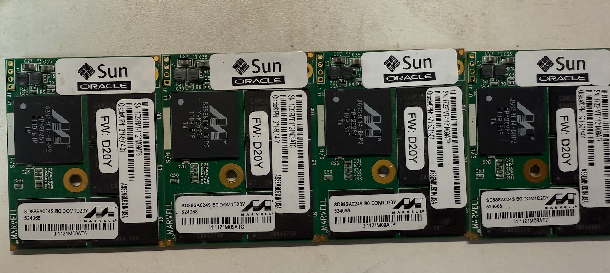

# Oracle F20 ——古董的SLC加速方案

## 背景介绍

F20是当初群友在讨论SLC的时候推荐的，由于价格便宜且没有认亲就直接拿下了。这张卡由于是10年前Oracle的存储方案，所以并不是一张纯粹的SLC硬盘，而是一张带四块SLC硬盘的HBA卡。

| Feature                                   | Value            |
|-------------------------------------------|------------------|
| Capacity per card                         | 96 GB (4 x 24 GB)|
| Random 4 K read                           | 100,110 IOPS     |
| Maximum delivered random 4 K write        | 83,996 IOPS      |
| Sequential read (1 M)                     | 1,092 MB/sec     |
| Maximum delivered sequential write (1 M)  | 501 MB/sec       |
| Power consumption (normal running mode)   | 16.5 W           |

## DOM（Disk on Module）的设计理念

在 Sun Flash Accelerator F20 PCIe 卡中，**DOM（Disk on Module）** 是一个非常关键的创新设计。它把闪存存储和控制芯片紧密集成在一个小巧的模块中，实现了高性能和高可靠性的平衡。

每个 DOM 其实就是一个微型的 SATA 闪存设备，它由以下几部分组成：

### 1. SLC NAND 闪存

- 每个 DOM 内含 **8 颗 4GB SLC NAND 芯片**（正反面各 4 颗），总容量 32GB，其中 **24GB 可用作主存储**，剩余空间用于提升寿命和性能。
- 这些多余的块可以在后台执行擦写、替换故障块，从而保证长期可靠运行。
- SLC NAND 属于企业级闪存，比常见的消费级闪存寿命更长、稳定性更高。

### 2. DRAM 缓存

- 每个 DOM 配置 **64MB DDR400 DRAM** 作为本地缓存，加速读写操作。
- 一旦系统突然断电，DRAM 中的数据会立即写入 NAND 闪存，确保数据完整不丢失。

### 3. 闪存控制器

- DOM 内建 **Marvell SATA-2 控制器**，它让模块直接用标准 SATA 协议与系统通信。
- 控制器负责：
  - **磨损均衡（Wear Leveling）**：避免某些块被过度写入，延长 NAND 使用寿命。
  - **错误纠正（ECC）**：保障数据可靠性。
  - **坏块管理**：检测并屏蔽故障块，用备用块替换。
  - **I/O 加速**：通过负载均衡和交错访问来优化性能。

### 

## SAS 控制器与 SAS 扩展器

在 Sun Flash Accelerator F20 PCIe 卡中，除了 DOM 模块之外，还有一套完整的 **SAS 控制/扩展架构**，用来连接和管理更多存储设备。

### 1. SAS 控制器

- 采用 **LSI SAS1068E 控制器**，这是一个 **8 端口的控制器**，同时具备 **8 通道 PCIe 接口**。
- 每个端口支持 **3.0 Gb/s** 的 SAS 或 SATA 传输速率，符合 PCIe 1.0a 标准，并且兼容 SATA 设备。
- 端口分工：
  - **4 个端口**直接连接 4 个 DOM 模块。
  - **另 4 个端口**则连接到 12 端口的 SAS 扩展器，从而支持额外的磁盘。

### 2. 12 端口 SAS 扩展器

- 卡上集成了 **LSISASx12 扩展器**，符合 ANSI 定义的 SAS 标准，同时支持 SATA 协议。
- 它提供了两组 **4 通道 mini-SAS（SFF 8087）接口**，可以扩展到机箱内的存储，例如：
  - 在 Sun SPARC Enterprise T5220 服务器中，可以直接连到 **8 盘位 HDD 背板**。
  - 在 Sun Fire X4275 存储服务器中，可以通过 LSISASx36 扩展器进一步扩展，支持 **16 块内部 HDD**。

## 性能测试

坏消息，这张卡读不出来了，等有机会再接着测试吧（（（（（

## 最后杂谈

这张卡有趣的部分是还存在跳线（请无视上面的猫毛）

