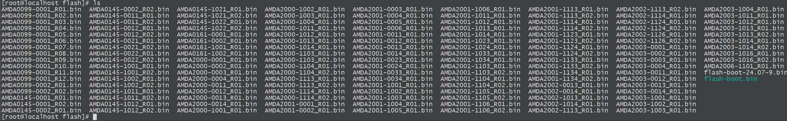
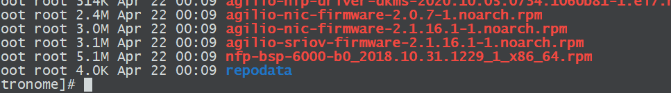
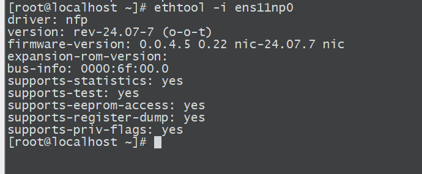

# 拯救 Agilio CX

> 抢救一下我的Agilio CX 1X40G网卡！

这张卡买了好久，由于启动时报错就丢在一边没在管过。

```sh
nfp: NFP PCIe Driver, Copyright (C) 2014-2020 Netronome Systems
nfp: NFP PCIe Driver, Copyright (C) 2021-2022 Corigine Inc.
nfp 0000:6f:00.0: enabling device (0140 -> 0142)
nfp 0000:6f:00.0: Network Flow Processor NFP4000/NFP5000/NFP6000 PCIe Card Probe
nfp 0000:6f:00.0: 31.504 Gb/s available PCIe bandwidth, limited by 8.0 GT/s PCIe x4 link at 0000:6e:01.0 (capable of 63.008 Gb/s with 8.0 GT/s PCIe x8 link)
nfp 0000:6f:00.0: RESERVED BARs: 0.0: General/MSI-X SRAM, 0.1: PCIe XPB/MSI-X PBA, 0.4: Explicit0, 0.5: Explicit1, free: 20/24
nfp 0000:6f:00.0: Model: 0x62000010, SN: 00:15:4d:12:23:78, Ifc: 0x10ff
nfp 0000:6f:00.0: Assembly: SMAAMDA0081-000116110061-15 CPLD: 0x1000002
nfp 0000:6f:00.0: nfp_nsp: drivers/net/ethernet/netronome/nfp/nfpcore/nfp_nsp.c:255: ABI too old to support NIC operation (0.6 < 0.8), please update the management FW on the flash
nfp 0000:6f:00.0: Failed to access the NSP: -22
nfp: probe of 0000:6f:00.0 failed with error -22
```

从dmesg给到的信息可以看出，ABI too old to support NIC operation (0.6 < 0.8), please update the management FW on the flash

ABI版本太老导致驱动与卡无法正常的通讯。正好前几天翻阅netronome的官网发现了一篇文章。

[Recovering an Unresponsive Agilio SmartNIC](https://help.netronome.com/support/solutions/articles/36000088693-recovering-an-unresponsive-agilio-smartnic)

本着死马便当活马医的想法，便开始探寻能不能抢救一下。

## 抢救记录

Netronome提供了两种刷写flash的方法，Update via Ethtool和Update via BSP Userspace Tools。由于nfp驱动无法正常的与卡通讯，导致没法拉起端口。所以ethtool的升级法无法使用。故而只能转向Update via BSP Userspace Tools

```
Obtain Out of Tree NFP Driver
To update the flash using the BSP userspace tools, use the following steps. Refer to Appendix C: Installing the Out-of-Tree NFP Driver on installing the out of tree NFP driver and to load the driver with CPP access.

Flash the Card
The following commands may be executed for each card installed in the system using the PCI address of the particular card. In this section, the card’s PCI address is assumed to be 0000:04:00.0. First reload the NFP drivers with CPP access enabled:

# rmmod nfp
# modprobe nfp nfp_pf_netdev=0 nfp_dev_cpp=1
Then use the included Netronome flashing tools to reflash the card:

# /opt/netronome/bin/nfp-flash --preserve-media-overrides  -w /opt/netronome/flash/flash-nic.bin -Z 0000:04:00.0
# /opt/netronome/bin/nfp-flash -w /opt/netronome/flash/flash-one.bin  -Z 0000:04:00.0
# reboot
```

在安装OOT的驱动时会遇到编译失败问题，可以参考 [Netronome-Smartnic-Explore](https://blog.lenxy.net/2025/02/14/Netronome-Smartnic-Explore/) 这篇文章。

随后的问题则是，Corigine提供的bsp包里面是没有flash-nic.bin和flash-one.bin。只有一个flash-boot还不好说能不能用。

好在netronome的yum Repositories还能用，让我在里面找到了18年的bsp文件。



后续就简单了许多，按照文档里给的两次更新flash。*（忽略nfp-flash的报错，尤其是二次刷入时flash-one.bin  是个很小的固件。一闪而过的刷新会让你觉得失败了）*

```
[  290.946147] Warning: Unmaintained driver is detected: nfp_main_init
[  290.946392] nfp: NFP PCIe Driver, Copyright (C) 2014-2020 Netronome Systems
[  290.946554] nfp: NFP PCIe Driver, Copyright (C) 2021-2022 Corigine Inc.
[  290.946697] nfp src version: rev-24.07-7 (o-o-t)
               nfp src path: /usr/src/agilio-nfp-driver-24.07-7/src/
               nfp build user id: root
               nfp build user: root
               nfp build host: localhost.localdomain
               nfp build path: /usr/src/agilio-nfp-driver-24.07-7/src
[  290.948315] nfp-net-vnic: NFP vNIC driver, Copyright (C) 2010-2020 Netronome Systems
[  290.949412] nfp-net-vnic: NFP vNIC driver, Copyright (C) 2021-2022 Corigine Inc.
[  290.951004] nfp 0000:6f:00.0: Single-PF detected
[  290.951203] nfp 0000:6f:00.0: Network Flow Processor NFP4000/NFP5000/NFP6000 PCIe Card Probe
[  290.951385] nfp 0000:6f:00.0: 31.504 Gb/s available PCIe bandwidth, limited by 8.0 GT/s PCIe x4 link at 0000:6e:01.0 (capable of 63.008 Gb/s with 8.0 GT/s PCIe x8 link)
[  290.956391] nfp 0000:6f:00.0: RESERVED BARs: 0.0: General/MSI-X SRAM, 0.1: PCIe XPB/MSI-X PBA, 0.4: Explicit0, 0.5: Explicit1, free: 20/24
[  290.956823] nfp 0000:6f:00.0: Model: 0x62000010, SN: 00:11:12:12:dd:78, Ifc: 0x10ff
[  290.961643] nfp 0000:6f:00.0: Assembly: SMAAMDA0081-000116110061-15 CPLD: 0x1000002
[  291.259087] nfp 0000:6f:00.0: BSP: 020028.020028.02007f
[  291.259930] nfp 0000:6f:00.0: nfp: Looking for firmware file in order of priority:
[  291.275665] nfp 0000:6f:00.0: nfp:   netronome/serial-00-11-12-12-dd-78-10-ff.nffw: not found
[  291.275855] nfp 0000:6f:00.0: nfp:   netronome/pci-0000:6f:00.0.nffw: not found
[  291.276042] nfp 0000:6f:00.0: nfp:   netronome/AMDA0081-0001.nffw: not found
[  291.278155] nfp 0000:6f:00.0: nfp:   netronome/nic_AMDA0081-0001_1x40.nffw: found
[  291.278330] nfp 0000:6f:00.0: Soft-resetting the NFP
[  302.629736] nfp 0000:6f:00.0: Finished loading FW image
[  302.657880] nfp 0000:6f:00.0 eth0: NFP-6xxx Netdev: TxQs=64/64 RxQs=8/64
[  302.658063] nfp 0000:6f:00.0 eth0: VER: 0.0.4.5, Maximum supported MTU: 9532
[  302.658228] nfp 0000:6f:00.0 eth0: CAP: 0xe3c6a633 PROMISC RXCSUM TXCSUM RXQINQ RXVLANv2 TXVLANv2 GATHER TSO1 RSS1 RSS2 IRQMOD VEPA VXLAN NVGRE RXCSUM_COMPLETE LIVE_ADDR MULTICAST_FILTER 
[  302.666892] nfp 0000:6f:00.0 ens11np0: renamed from eth0
```

## 复活吧我的网卡！



## 后续升级

这个奇妙网卡的BSP: 020028.020028.02007f 有点老，所以要做后续的升级。首先找到适配版本的bsp工具包。*最新可用的包是nfp-bsp_23.07-3.el8.x86_64.rpm*

```sh
[root@localhost bin]# ./nfp-fw-update -n 1 -c   

NFP DEVICE ID:1 SMAAMDA0081-000116110061 r15
BSP version is 020028.020028.02007f and should be 23.07-3
CPLD version is 0x01000002 and should be 0x01030000
Updates are required.
Reboot required for updates to take effect.
Updates are required.
AC power cycle required for updates to take effect.
[root@localhost bin]# ./nfp-fw-update -n 1 -u

NFP DEVICE ID:1 SMAAMDA0081-000116110061 r15
BSP version is 020028.020028.02007f and should be 23.07-3
CPLD version is 0x01000002 and should be 0x01030000
/opt/netronome/bin/nfp-cpld-prog -n1 -f/tmp/cpld.jed
JTAG probe TAP 0 IDCODE:012b9043 (LMXO2)
Good Transmission Checksum:0xb2ba
image contains 1 CFG sections, totaling 699 pages
image contains 0 UFM sections, totaling 0 pages

Mach XO2 Prog Start ...
 Checking device ID ...
 Enable config interface TRANSPARENT MODE...
 Erase flash ...
 Programming CONFIG flash ...
    programming CFG flash page     0 to   698 ...       698
 Not programming UFM
 Programming usercode ...
 Checking usercode ...
 Verifying CONFIG flash ...
        reading CFG flash page     0 to   698 ...       698
 Not verifying UFM
 Writing feature row ...
 Writing feature bits ...
 Signaling flash program done ...
 Checking for status done ...
 Not writing SECURITY BIT
 Not programming OTP fuses
 Disabling config interface ...
 Average CPLD busy period 17 ms
 Total elapsed time 01:06.250
00:00:01 [============================================================]  100%
00:00:34 [============================================================]  100%
Reboot required for updates to take effect.
AC power cycle required for updates to take effect.
[root@localhost bin]# reboot


NFP DEVICE ID:0 SMCAMDA0099-000117341047 r11
                 bsp.version.running:   24.07-9
                 bsp.version.flashed:   24.07-9
                cpld.version.running:   0x3030000
           bspbundle.version.flashed:   bspbundle_062025094747_ebea8774
        configurator.version.running:   AMDA-0099-0001  20200824142802
        configurator.version.flashed:   AMDA-0099-0001  20200824142802

NFP DEVICE ID:1 SMAAMDA0081-000116110061 r15
                 bsp.version.running:   23.07-3
                 bsp.version.flashed:   23.07-3
                cpld.version.running:   0x1030000
           bspbundle.version.flashed:   bspbundle_080223094102_c5a74bcd
        configurator.version.running:   AMDA-0081-0001  20200824142802
        configurator.version.flashed:   AMDA-0081-0001  20200824142802
```

