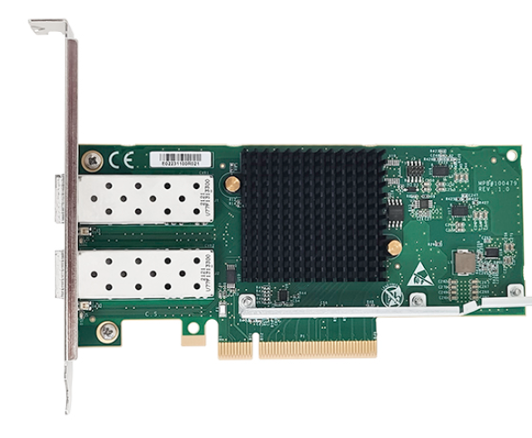
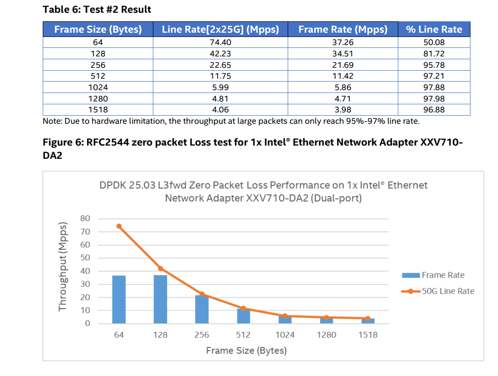
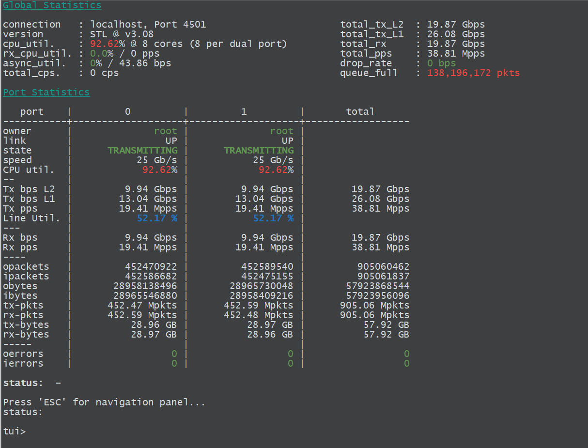
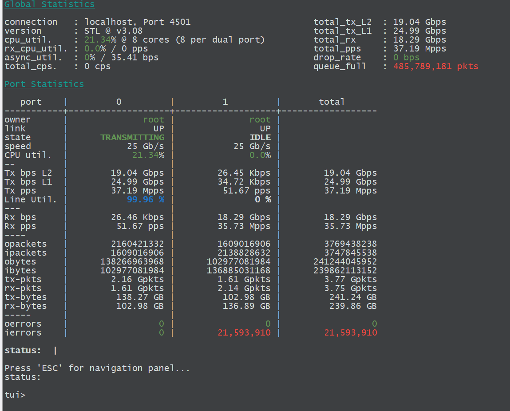
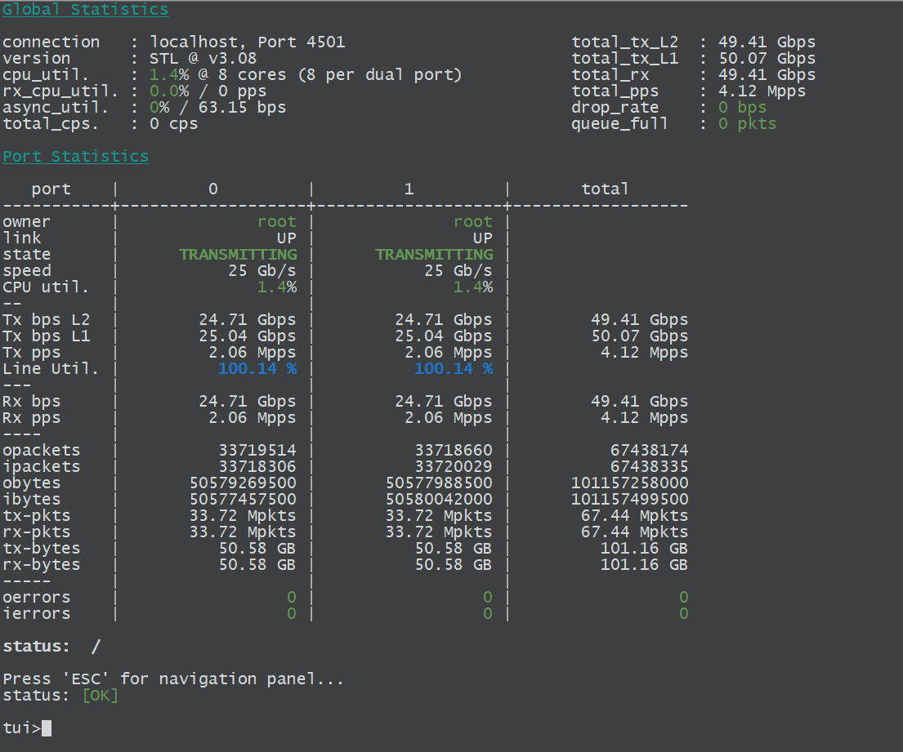

# 为何不品鉴一下Intel XXV710

> 被浓眉大眼的GPT给骗了！他跟我说XXV710 技术成熟能跑Trex，结果的确能跑，小包根本不能看。

## **XXV 710 Silicom版 固件升级指南**

本期产品是我图便宜买的Silicom PE425G2I81 （借用一下官网的证件照）



到手发现固件好老

```shell
# ethtool -i 
driver: i40e 
version: 6.17.2-1-pve 
firmware-version: 6.02 0x800039d1 1.1691.0 
expansion-rom-version: 
bus-info: 0000:08:00.0 
supports-statistics: yes 
supports-test: yes 
supports-eeprom-access: yes 
supports-register-dump: yes 
supports-priv-flags: yes

# ./nvmupdate64e -i -l inventory.log
[00:008:00:00]: Intel(R) Ethernet Controller XXV710 for 25GbE SFP28
        Vendor                 : 8086
        Device                 : 158B
        Subvendor              : 1374
        Subdevice              : 2A41
        Revision               : 2
        LAN MAC                : 00AABBCCDDEE
        Alt MAC                : 000000000000
        SAN MAC                : 000000000200
        ETrackId               : ########
        SerialNumber           : ########
        NVM Version            : 6.02(6.02)
        PBA                    : 100000-000
        VPD status             : Valid
        VPD size               : 125
        NVM update             : No config file entry
          checksum             : Valid
        OROM update            : No config file entry
          CIVD                 : 0.0.0
```

到这就坏起来了，nvmupdate默认是不支持给第三方设备升级固件的。他会匹配Subvendor ，所以我们需要手动去构建一个nvmupdate.cfg配置文件。

```shell
# cat nvmupdate-cross-xxv710da2.cfg
CURRENT FAMILY: 1.0.0
CONFIG VERSION: 1.14.0

BEGIN DEVICE
DEVICENAME: XXV710
VENDOR: 8086
DEVICE: 158B
NVM IMAGE: XXV710DA2_9p57_CFGID12p0_OEMGEN.bin
OROM IMAGE: BootIMG.FLB
EEPID: 800103A8
REPLACES: 800039D1
EEPROM MAP: 25G_PHY_MISC_4.txt
RESET TYPE: REBOOT
END DEVICE

# ./nvmupdate64e -u -b -p \
  -l update-cross-xxv710da2.log \
  -o update-cross-xxv710da2.xml \
  -c nvmupdate-cross-xxv710da2.cfg \
  -m 00AABBCCDDEE  #这里写mac地址 

刷写完毕后重启电脑去保证固件应用

# ethtool -i ens5f0np0
driver: i40e
version: 6.17.2-1-pve
firmware-version: 9.57 0x800103a8 1.1691.0
expansion-rom-version: 
bus-info: 0000:08:00.0
supports-statistics: yes
supports-test: yes
supports-eeprom-access: yes
supports-register-dump: yes
supports-priv-flags: yes
root@pve:~/700Series/Linux_x64# 
```

到这里就升级完成了。

## Trex下的性能表现

这就是要吐槽的内容了，XXV710的DPDK性能表现非常差，查阅Intel的文档得知64b小包只有37mpps。根本无法满足小包限速的测试需求。



双口的情况下只能跑19Mpps  测试命令 `start -f stl/bench.py -p 0 1  -m 100% -t vm=cached,size=64`



单口情况下可以跑线速，但是出现了积压和 ierrors的问题 测试命令 `start -f stl/bench.py -p 0 1  -m 100% -t vm=cached,size=64`



当然，最基础的1500大包是一点问题没有的


