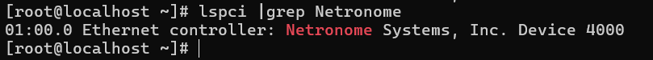
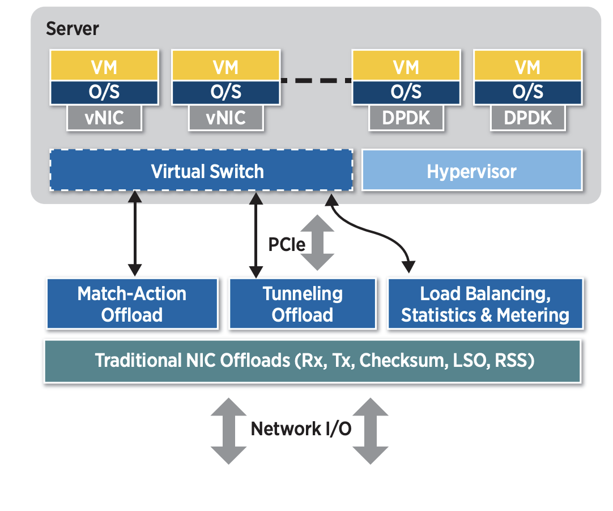
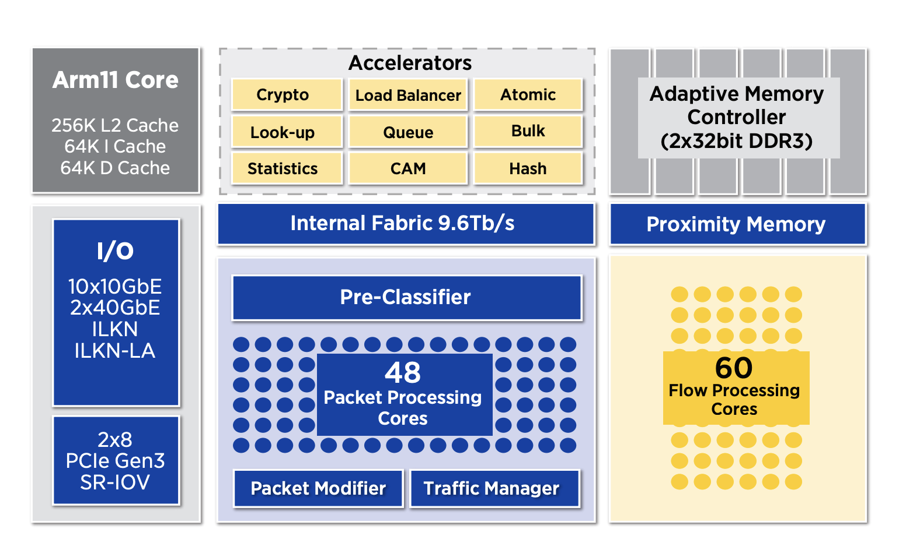
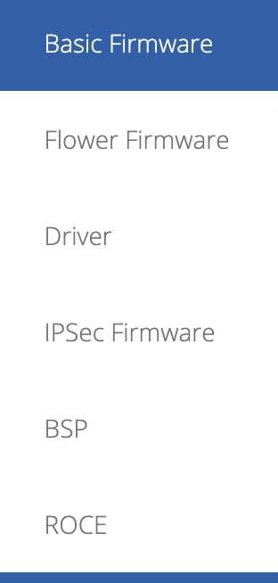
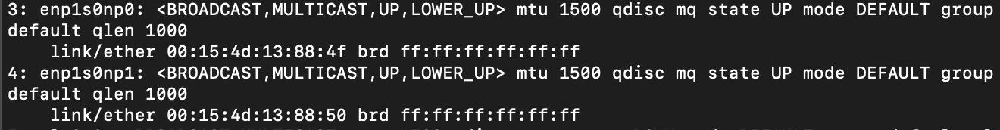
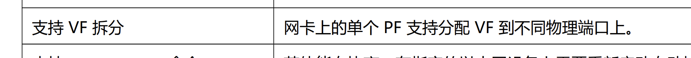

# 探索Netronome智能网卡


## 前言

先说一下前言吧，当初买这块网卡是因为逛咸鱼的时候发现这张网卡是船新且箱书全才入的。但是经过研究Netronome公司貌似已经停止更新官网网站一年了。

后来在搜索的时候查到了另一家公司 Corigine 。发现Netronome公司的产品Agilio系列网卡已经改头换面可能是被国产公司收购了。由于我买的是老版本所以lspci中会显示Netronome，如果是新产品就会改为Corigine。



本次的网卡是Agilio CX 2x25G，面向客户是数据中心的云环境。提供了ovs-offload的支持，其他的功能我感觉支持的比较烂。



这里需要提一下Agilio的NFP(Network Flow Processor)  NFP是Netronome自研的流量处理芯片。其提供了60个可编程流处理器与48个包处理器。貌似是可以支持P4的编程语言，可惜由于资料缺乏这部分只能等后续再深入研究了。



## 开始踩坑

从kernel 4.16开始，这张卡的驱动程序已经进入主线了，所以无需安装驱动就可以直接识别的。但是当我插入了这张卡时是无法识别网口的。经查看 *dmesg* 中无法找到网卡固件。

```
[248843.966152] nfp 0000:01:00.0: nfp: drivers/net/ethernet/netronome/nfp/nfp_main.c:390: Looking for firmware file in order of priority:
[248843.968587] nfp 0000:01:00.0: nfp: drivers/net/ethernet/netronome/nfp/nfp_main.c:364:   netronome/serial-00-15-4d-13-88-4e-10-ff.nffw: not found
[248843.970284] nfp 0000:01:00.0: nfp: drivers/net/ethernet/netronome/nfp/nfp_main.c:364:   netronome/pci-0000:01:00.0.nffw: not found
[248843.970941] nfp 0000:01:00.0: nfp: drivers/net/ethernet/netronome/nfp/nfp_main.c:364:   netronome/nic_AMDA0099-0001_2x25.nffw: not found
[248843.971308] nfp 0000:01:00.0: Didn't load firmware, please update flash or reconfigure card
[248843.972027] nfp 0000:01:00.0: nfp: drivers/net/ethernet/netronome/nfp/nfp_net_main.c:653: No firmware found, giving up.
[248843.972535] nfp: probe of 0000:01:00.0 failed with error -22
```

这是也是第一个坑了，网卡默认是没有固件的，驱动程序会在 /lib/firmware/netronome目录下识别固件

识别顺序：

```
1: serial-_SERIAL_.nffw 
2: pci-_PCI_ADDRESS_.nffw 
3: nic-_ASSEMBLY-TYPE___BREAKOUTxMODE_.nffw`
```



这张网卡将不同的功能支持做成了不同的固件。如上图所示。且可以针对不同的网卡动态加载不同的固件, 去官网下载固件包后即可正常的识别网卡。

```shell
#基础版固件
wget https://download.corigine.com.cn/public/packages/agilio-nic-firmware-24.07-6.noarch.rpm  #更新 本站点已经无法访问了。
rpm -ivh agilio-nic-firmware-24.07-6.noarch.rpm  
rmmod nfp; modprobe nfp

############# dmesg log #############
nfp 0000:01:00.0: nfp: drivers/net/ethernet/netronome/nfp/nfp_main.c:390: Looking for firmware file in order of priority:
nfp 0000:01:00.0: nfp: drivers/net/ethernet/netronome/nfp/nfp_main.c:364:   netronome/serial-00-15-4d-13-88-4e-10-ff.nffw: not found
nfp 0000:01:00.0: nfp: drivers/net/ethernet/netronome/nfp/nfp_main.c:364:   netronome/pci-0000:01:00.0.nffw: not found
nfp 0000:01:00.0: nfp: drivers/net/ethernet/netronome/nfp/nfp_main.c:364:   netronome/nic_AMDA0099-0001_2x25.nffw: found
nfp 0000:01:00.0: Soft-resetting the NFP
nfp 0000:01:00.0: Finished loading FW image
```



在这里要填一个坑。与CX3设备类似，此网卡虽然有两个网口，但是只公开了一个总线地址。所以无法分端口的进行直通。我也尝试使用VF来实现这个功能但是我在官网中找到了这个

> 在单 PF 时，如果网卡有多个物理端口（phyport），VFs 将显示连接到所有的物理端口（ip link 命令显示）。这是因为 PF 在所有 VFs 之间共享。实际上，VF 默认分配给 phyport0。




但是又有说明 23.01版本可以分配到不同端口，但是没有提及配置方法所以只能留坑。

剩下的内容需要咕咕一下了。本来准备用t-rex来进行流量测试，奈何手中没有靠谱的25g网卡或者100g拆分4*25的dac线。所以没法实现后续的东西只能等材料全了再搞了。


## 填坑计划-BSP升级

> NFP 有一个内部的命令推/拉（CPP）总线，允许对网卡内部器件进行调试访问。CPP 访问允许用户空间工具对芯片内部的原始访问，并且是大多数 BSP 工具使用所必需的。只有 OOT 驱动程序允许 CPP 访问。

先从官网获取 `agilio-nfp-driver-dkms-24.07-7.noarch.rpm`

```shell
# cd /usr/src/agilio-nfp-driver-24.07-7
# make install       #make失败的看下文
# modinfo nfp
filename:       /lib/modules/5.14.0-570.12.1.el9_6.x86_64/updates/nfp.ko
nfp_build_path: /usr/src/agilio-nfp-driver-24.07-7/src
nfp_build_host: RD450X
nfp_build_user: root
nfp_build_user_id:  root
nfp_src_path:   /usr/src/agilio-nfp-driver-24.07-7/src/
nfp_src_version:rev-24.07-7 (o-o-t)
version:        6.12.0
description:    The Network Flow Processor (NFP) driver.
license:        GPL
author:         Corigine, Inc. <oss-drivers@corigine.com>
firmware:       netronome/AMDA2002-1114.nffw
firmware:       netronome/AMDA2002-1113.nffw
firmware:       netronome/AMDA2001-1104.nffw
firmware:       netronome/AMDA2001-1103.nffw
firmware:       netronome/AMDA2000-1104.nffw
firmware:       netronome/AMDA2000-1103.nffw
firmware:       netronome/AMDA0161-1001.nffw
firmware:       netronome/nic_AMDA0099-0001_1x10_1x25.nffw
firmware:       netronome/nic_AMDA0099-0001_2x25.nffw
firmware:       netronome/nic_AMDA0099-0001_2x10.nffw
firmware:       netronome/nic_AMDA0097-0001_8x10.nffw
firmware:       netronome/nic_AMDA0097-0001_4x10_1x40.nffw
firmware:       netronome/nic_AMDA0097-0001_2x40.nffw
firmware:       netronome/nic_AMDA0096-0001_2x10.nffw
firmware:       netronome/nic_AMDA0081-0001_4x10.nffw
firmware:       netronome/nic_AMDA0081-0001_1x40.nffw
firmware:       netronome/nic_AMDA0058-0012_2x40.nffw
firmware:       netronome/nic_AMDA0058-0011_2x40.nffw
rhelversion:    9.6

# modprobe nfp nfp_dev_cpp=1      #在 nfp 模块构建完成后，加载具有 CPP 访问权限的驱动
# nfp-fw-update -c #检查版本
NFP DEVICE ID:0 SMCAMDA0099-000117341047 r11
Configurator is AMDA-0099-0001  20170209101825 and should be AMDA-0099-0001  20200824142802
Updates are required.
Reboot required for updates to take effect.
# nfp-fw-update -u #升级 
# nfp-fw-update  #完成升级
NFP DEVICE ID:0 SMCAMDA0099-000117341047 r11
                 bsp.version.running:   24.07-9
                 bsp.version.flashed:   24.07-9
                cpld.version.running:   0x3030000
           bspbundle.version.flashed:   bspbundle_062025094747_ebea8774
        configurator.version.running:   AMDA-0099-0001  20200824142802
        configurator.version.flashed:   AMDA-0099-0001  20200824142802

```


## 驱动文件修补

在我近日折腾这张网卡的时候，发现编译出现了问题。（RHEL!)

```bash
/usr/src/agilio-nfp-driver-24.07-7/src/crdma/crdma_counters.c:301:28: error: initialization of ‘int (*)(struct rdma_counter *, struct ib_qp *, u32)’ {aka ‘int (*)(struct rdma_counter *, struct ib_qp *, unsigned int)’} from incompatible pointer type ‘int (*)(struct rdma_counter *, struct ib_qp *)’ [-Werror=incompatible-pointer-types]
  301 |         .counter_bind_qp = crdma_ib_counter_bind_qp,
      |                            ^~~~~~~~~~~~~~~~~~~~~~~~
/usr/src/agilio-nfp-driver-24.07-7/src/crdma/crdma_counters.c:301:28: note: (near initialization for ‘crdma_hw_stats_ops.counter_bind_qp’)
/usr/src/agilio-nfp-driver-24.07-7/src/crdma/crdma_counters.c:302:30: error: initialization of ‘int (*)(struct ib_qp *, u32)’ {aka ‘int (*)(struct ib_qp *, unsigned int)’} from incompatible pointer type ‘int (*)(struct ib_qp *)’ [-Werror=incompatible-pointer-types]
  302 |         .counter_unbind_qp = crdma_ib_counter_unbind_qp,
      |                              ^~~~~~~~~~~~~~~~~~~~~~~~~~
/usr/src/agilio-nfp-driver-24.07-7/src/crdma/crdma_counters.c:302:30: note: (near initialization for ‘crdma_hw_stats_ops.counter_unbind_qp’)
cc1: some warnings being treated as errors
make[2]: *** [scripts/Makefile.build:249: /usr/src/agilio-nfp-driver-24.07-7/src/crdma/crdma_counters.o] Error 1
make[1]: *** [Makefile:1953: /usr/src/agilio-nfp-driver-24.07-7/src] Error 2
make[1]: Leaving directory '/usr/src/kernels/5.14.0-611.47.1.el9_7.x86_64‘
```
多多少少笑不出来了，这个版本的Kernel把6.11的 RDMA core 变更移植过来了。以至于不得不新增一个 u32 port

```c
static int crdma_ib_counter_bind_qp(struct rdma_counter *counter,
                                   struct ib_qp *qp,u32 port)    <-----------新增了u32 port 
{
       
}

static int crdma_ib_counter_unbind_qp(struct ib_qp *qp,u32 port)  <-----------新增了u32 port 
{
        
}
```


## VPP的尝试

为了测试下DPDK是否能正确分辨出端口，索性直接用VPP来进行测试了。正好看下能不能顺利地跑流量。

由于测试环境是RockyLinux 所以需要自行编译VPP

```shell
git clone https://gerrit.fd.io/r/vpp
cd vpp
make install-dep
make pkg-rpm
rpm -ivh build-root/*.rpm
```

好吧，vpp提示dpdk并不支持这个网卡： **dpdk: Unsupported PCI device 0x19ee:0x4000 found at PCI address 0000:01:00.0**

于是我手动对这张网卡进行了dpdk的绑定

```shell
$./dpdk_nic_bind.py --status

Network devices using DPDK-compatible driver
============================================
<none>

Network devices using kernel driver
===================================
0000:01:00.0 'Device 4000' if=enp1s0np0,enp1s0np1 drv=nfp unused=uio_pci_generic 
0000:05:00.0 'RTL8125 2.5GbE Controller' if=enp5s0 drv=r8169 unused=uio_pci_generic *Active*

Other network devices
=====================
<none>

$./dpdk_nic_bind.py  --bind=vfio-pci 0000:01:00.0

$./dpdk_nic_bind.py  --status

Network devices using DPDK-compatible driver
============================================
0000:01:00.0 'Device 4000' drv=vfio-pci unused=nfp,uio_pci_generic

Network devices using kernel driver
===================================
0000:05:00.0 'RTL8125 2.5GbE Controller' if=enp5s0 drv=r8169 unused=vfio-pci,uio_pci_generic *Active*

Other network devices
=====================
<none>

```


## 信息留存

Dmesg

```dmesg
[  143.076715] nfp: NFP PCIe Driver, Copyright (C) 2014-2020 Netronome Systems
[  143.076728] nfp: NFP PCIe Driver, Copyright (C) 2021-2022 Corigine Inc.
[  143.076740] nfp src version: rev-24.07-7 (o-o-t)
               nfp src path: /usr/src/agilio-nfp-driver-24.07-7/src/
               nfp build user id: root
               nfp build user: root
               nfp build host: localhost.localdomain
               nfp build path: /usr/src/agilio-nfp-driver-24.07-7/src
[  143.077131] nfp-net-vnic: NFP vNIC driver, Copyright (C) 2010-2020 Netronome Systems
[  143.077166] nfp-net-vnic: NFP vNIC driver, Copyright (C) 2021-2022 Corigine Inc.
[  143.078891] nfp 0000:01:00.0: Single-PF detected
[  143.078906] nfp 0000:01:00.0: Network Flow Processor NFP4000/NFP5000/NFP6000 PCIe Card Probe
[  143.079017] nfp 0000:01:00.0: 63.008 Gb/s available PCIe bandwidth (8.0 GT/s PCIe x8 link)
[  143.079476] nfp 0000:01:00.0: RESERVED BARs: 0.0: General/MSI-X SRAM, 0.1: PCIe XPB/MSI-X PBA, 0.4: Explicit0, 0.5: Explicit1, free: 20/24
[  143.079717] nfp 0000:01:00.0: Model: 0x62000010, SN: 00:15:4d:02:1e:aa , Ifc: 0x10ff
[  143.083629] nfp 0000:01:00.0: Assembly: SMCAMDA0099-000117341047-11 CPLD: 0x3030000
[  143.218026] nfp 0000:01:00.0: BSP: 24.07-9
[  143.298997] nfp 0000:01:00.0: nfp: Looking for firmware file in order of priority:
[  143.301935] nfp 0000:01:00.0: nfp:   netronome/serial-00-15-4d-13-88-4e-10-ff.nffw: not found
[  143.302136] nfp 0000:01:00.0: nfp:   netronome/pci-0000:01:00.0.nffw: not found
[  143.302343] nfp 0000:01:00.0: nfp:   netronome/AMDA0099-0001.nffw: not found
[  143.320101] nfp 0000:01:00.0: nfp:   netronome/nic_AMDA0099-0001_2x25.nffw: found
[  143.320125] nfp 0000:01:00.0: Soft-resetting the NFP
[  157.504132] nfp 0000:01:00.0: nfp_nsp: Firmware from driver loaded, no FW selection policy HWInfo key found
[  157.504146] nfp 0000:01:00.0: Finished loading FW image
[  157.666712] nfp 0000:01:00.0 eth0: NFP-6xxx Netdev: TxQs=32/32 RxQs=8/32
[  157.666744] nfp 0000:01:00.0 eth0: VER: 0.0.4.5, Maximum supported MTU: 9532
[  157.666758] nfp 0000:01:00.0 eth0: CAP: 0xe3c6a633 PROMISC RXCSUM TXCSUM RXQINQ RXVLANv2 TXVLANv2 GATHER TSO1 RSS1 RSS2 IRQMOD VEPA VXLAN NVGRE RXCSUM_COMPLETE LIVE_ADDR MULTICAST_FILTER 
[  159.800267] nfp 0000:01:00.0 eth0: NFP-6xxx Netdev: TxQs=32/32 RxQs=8/32
[  159.800289] nfp 0000:01:00.0 eth0: VER: 0.0.4.5, Maximum supported MTU: 9532
[  159.800308] nfp 0000:01:00.0 eth0: CAP: 0xe3c6a633 PROMISC RXCSUM TXCSUM RXQINQ RXVLANv2 TXVLANv2 GATHER TSO1 RSS1 RSS2 IRQMOD VEPA VXLAN NVGRE RXCSUM_COMPLETE LIVE_ADDR MULTICAST_FILTER 
[  159.810739] nfp 0000:01:00.0 enp1s0np1: renamed from eth0
```

lspci 

```lspci
08:00.0 Ethernet controller: Corigine, Inc. Device 4000
        Subsystem: Corigine, Inc. Device 0099
        Physical Slot: 5
        Control: I/O+ Mem+ BusMaster+ SpecCycle- MemWINV- VGASnoop- ParErr+ Stepping- SERR+ FastB2B- DisINTx+
        Status: Cap+ 66MHz- UDF- FastB2B- ParErr- DEVSEL=fast >TAbort- <TAbort- <MAbort- >SERR- <PERR- INTx-
        Latency: 0, Cache Line Size: 32 bytes
        Interrupt: pin A routed to IRQ 29
        NUMA node: 0
        IOMMU group: 118
        Region 0: Memory at 383fd0000000 (64-bit, prefetchable) [size=128M]
        Region 2: Memory at 383fd8000000 (64-bit, prefetchable) [size=64M]
        Region 4: Memory at 383fdc000000 (64-bit, prefetchable) [size=16M]
        Expansion ROM at c0000000 [disabled] [size=16M]
        Capabilities: [80] Power Management version 3
                Flags: PMEClk- DSI- D1+ D2- AuxCurrent=0mA PME(D0+,D1+,D2-,D3hot+,D3cold-)
                Status: D0 NoSoftRst+ PME-Enable- DSel=0 DScale=0 PME-
        Capabilities: [b0] MSI-X: Enable+ Count=256 Masked-
                Vector table: BAR=0 offset=00000000
                PBA: BAR=0 offset=01100190
        Capabilities: [c0] Express (v2) Endpoint, IntMsgNum 0
                DevCap: MaxPayload 512 bytes, PhantFunc 0, Latency L0s <1us, L1 <1us
                        ExtTag- AttnBtn- AttnInd- PwrInd- RBE+ FLReset+ SlotPowerLimit 0W TEE-IO-
                DevCtl: CorrErr+ NonFatalErr+ FatalErr+ UnsupReq+
                        RlxdOrd- ExtTag- PhantFunc- AuxPwr- NoSnoop+ FLReset-
                        MaxPayload 256 bytes, MaxReadReq 512 bytes
                DevSta: CorrErr- NonFatalErr- FatalErr- UnsupReq- AuxPwr- TransPend-
                LnkCap: Port #0, Speed 8GT/s, Width x8, ASPM L0s L1, Exit Latency L0s <1us, L1 <1us
                        ClockPM- Surprise- LLActRep- BwNot- ASPMOptComp+
                LnkCtl: ASPM Disabled; RCB 64 bytes, LnkDisable- CommClk+
                        ExtSynch- ClockPM- AutWidDis- BWInt- AutBWInt-
                LnkSta: Speed 8GT/s, Width x8
                        TrErr- Train- SlotClk+ DLActive- BWMgmt- ABWMgmt-
                DevCap2: Completion Timeout: Range B, TimeoutDis+ NROPrPrP- LTR-
                         10BitTagComp- 10BitTagReq- OBFF Via message, ExtFmt- EETLPPrefix-
                         EmergencyPowerReduction Not Supported, EmergencyPowerReductionInit-
                         FRS- TPHComp+ ExtTPHComp-
                         AtomicOpsCap: 32bit+ 64bit+ 128bitCAS+
                DevCtl2: Completion Timeout: 50us to 50ms, TimeoutDis-
                         AtomicOpsCtl: ReqEn+
                         IDOReq- IDOCompl- LTR- EmergencyPowerReductionReq-
                         10BitTagReq- OBFF Disabled, EETLPPrefixBlk-
                LnkCap2: Supported Link Speeds: 2.5-8GT/s, Crosslink- Retimer- 2Retimers- DRS-
                LnkCtl2: Target Link Speed: 8GT/s, EnterCompliance- SpeedDis-
                         Transmit Margin: Normal Operating Range, EnterModifiedCompliance- ComplianceSOS-
                         Compliance Preset/De-emphasis: -6dB de-emphasis, 0dB preshoot
                LnkSta2: Current De-emphasis Level: -6dB, EqualizationComplete+ EqualizationPhase1+
                         EqualizationPhase2+ EqualizationPhase3+ LinkEqualizationRequest-
                         Retimer- 2Retimers- CrosslinkRes: unsupported
        Capabilities: [100 v2] Advanced Error Reporting
                UESta:  DLP- SDES- TLP- FCP- CmpltTO- CmpltAbrt- UnxCmplt- RxOF- MalfTLP-
                        ECRC- UnsupReq- ACSViol- UncorrIntErr- BlockedTLP- AtomicOpBlocked- TLPBlockedErr-
                        PoisonTLPBlocked- DMWrReqBlocked- IDECheck- MisIDETLP- PCRC_CHECK- TLPXlatBlocked-
                UEMsk:  DLP- SDES- TLP- FCP- CmpltTO- CmpltAbrt- UnxCmplt- RxOF- MalfTLP-
                        ECRC- UnsupReq- ACSViol- UncorrIntErr+ BlockedTLP- AtomicOpBlocked- TLPBlockedErr-
                        PoisonTLPBlocked- DMWrReqBlocked- IDECheck- MisIDETLP- PCRC_CHECK- TLPXlatBlocked-
                UESvrt: DLP+ SDES+ TLP- FCP+ CmpltTO- CmpltAbrt- UnxCmplt- RxOF+ MalfTLP+
                        ECRC- UnsupReq- ACSViol- UncorrIntErr+ BlockedTLP- AtomicOpBlocked- TLPBlockedErr-
                        PoisonTLPBlocked- DMWrReqBlocked- IDECheck- MisIDETLP- PCRC_CHECK- TLPXlatBlocked-
                CESta:  RxErr- BadTLP- BadDLLP- Rollover- Timeout- AdvNonFatalErr- CorrIntErr- HeaderOF-
                CEMsk:  RxErr- BadTLP- BadDLLP- Rollover- Timeout- AdvNonFatalErr+ CorrIntErr+ HeaderOF+
                AERCap: First Error Pointer: 00, ECRCGenCap+ ECRCGenEn- ECRCChkCap+ ECRCChkEn-
                        MultHdrRecCap- MultHdrRecEn- TLPPfxPres- HdrLogCap-
                HeaderLog: 00000000 00000000 00000000 00000000
        Capabilities: [140 v1] Alternative Routing-ID Interpretation (ARI)
                ARICap: MFVC- ACS-, Next Function: 0
                ARICtl: MFVC- ACS-, Function Group: 0
        Capabilities: [150 v1] Device Serial Number 00:15:4d:02:1e:aa
        Capabilities: [200 v1] Single Root I/O Virtualization (SR-IOV)
                IOVCap: Migration- 10BitTagReq- IntMsgNum 0
                IOVCtl: Enable- Migration- Interrupt- MSE- ARIHierarchy+ 10BitTagReq-
                IOVSta: Migration-
                Initial VFs: 64, Total VFs: 64, Number of VFs: 0, Function Dependency Link: 00
                VF offset: 64, stride: 1, Device ID: 6003
                Supported Page Size: 00000553, System Page Size: 00000001
                Region 0: Memory at 00000000c5000000 (64-bit, non-prefetchable)
                Region 2: Memory at 00000000c1000000 (64-bit, non-prefetchable)
                VF Migration: offset: 00000000, BIR: 0
        Capabilities: [300 v1] Secondary PCI Express
                LnkCtl3: LnkEquIntrruptEn- PerformEqu-
                LaneErrStat: 0
        Kernel driver in use: vfio-pci #没错 被我直通的
        Kernel modules: nfp
```

```ethtool
ethtool -i enp1s0np0
driver: nfp
version: rev-24.07-7 (o-o-t)
firmware-version: 0.0.4.5 0.39 nic-24.07.7 nic
expansion-rom-version: 
bus-info: 0000:01:00.0
supports-statistics: yes
supports-test: yes
supports-eeprom-access: yes
supports-register-dump: yes
supports-priv-flags: yes
```

