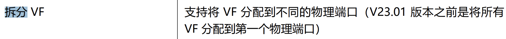

## 前言

先说一下前言吧，当初买这块网卡是因为逛咸鱼的时候发现这张网卡是船新且箱书全才入的。但是经过研究Netronome公司貌似已经停止更新官网网站一年了。

后来在搜索的时候查到了另一家公司 Corigine 。发现Netronome公司的产品Agilio系列网卡已经改头换面可能是被国产公司收购了。由于我买的是老版本所以lspci中会显示Netronome，如果是新产品就会改为Corigine。


本次的网卡是Agilio CX 2x25G，面向客户是数据中心的云环境。提供了ovs-offload的支持，其他的功能我感觉支持的比较烂。


这里需要提一下Agilio的NFP(Network Flow Processor)  NFP是Netronome自研的流量处理芯片。其提供了60个可编程流处理器与48个包处理器。貌似是可以支持P4的编程语言，可惜由于资料缺乏这部分只能等后续再深入研究了。


## 开始踩坑

从kernel 4.16开始，这张卡的驱动程序已经进入主线了，所以无需安装驱动就可以直接识别的。但是当我插入了这张卡时是无法识别网口的。经查看 *dmesg* 中无法找到网卡固件。这是也是第一个坑了，网卡默认是没有固件的，驱动程序会在 /lib/firmware/netronome目录下识别固件

识别顺序：

```
1: serial-_SERIAL_.nffw 
2: pci-_PCI_ADDRESS_.nffw 
3: nic-_ASSEMBLY-TYPE___BREAKOUTxMODE_.nffw`
```


这张网卡将不同的功能支持做成了不同的固件。如上图所示。且可以针对不同的网卡动态加载不同的固件。

去官网下载固件包后即可正常的识别网卡。


在这里要填一个坑。与CX3设备类似，此网卡虽然有两个网口，但是只公开了一个总线地址。所以无法分端口的进行直通。我也尝试使用VF来实现这个功能但是我在官网中找到了这个

> 在单 PF 时，如果网卡有多个物理端口（phyport），VFs 将显示连接到所有的物理端口（ip link 命令显示）。这是因为 PF 在所有 VFs 之间共享。实际上，VF 默认分配给 phyport0。




但是又有说明 23.01版本可以分配到不同端口，但是没有提及配置方法所以只能留坑。

剩下的内容需要咕咕一下了。本来准备用t-rex来进行流量测试，奈何手中没有靠谱的25g网卡或者100g拆分4*25的dac线。所以没法实现后续的东西只能等材料全了再搞了。
