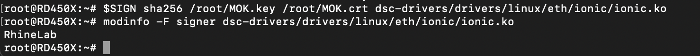
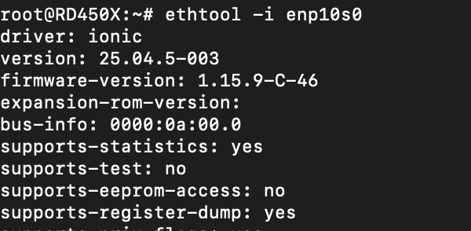

## 简略且快速的记录一下

从github下载完毕Pensando的驱动后，进行编译。编译完毕需要手动处理签名

所以这次的文章是从这里开始记载的 剩下的内容后续会慢慢填坑吧

生成证书

```shell
openssl req -new -x509 -newkey rsa:2048 -nodes -days 3650 \
  -subj "/CN=RhineLab/" \
  -keyout MOK.key -out MOK.crt
openssl x509 -in MOK.crt -outform DER -out MOK.der #将证书从PEM转为DER
```

将证书导入

```shell
mokutil --import MOK.der   #会让你输入密码，这个密码与后续bios里需要enroll的一致
reboot
```

重启完成后检查是否生效

```shell
mokutil --list-enrolled
```

对编译后的驱动签名

```shell
# Ubuntu/Debian
SIGN=/usr/src/linux-headers-$(uname -r)/scripts/sign-file
# RHEL/Fedora
# SIGN=/usr/src/kernels/$(uname -r)/scripts/sign-file

sudo $SIGN sha256 MOK.key MOK.crt /path/to/xxx.ko
modinfo -F signer /path/to/xxx.ko

```





正常载入驱动

```shell
root@RD450X:~# lspci -d 1dd8: 查看bus信息
08:00.0 PCI bridge: AMD Pensando Systems DSC2 Elba Upstream Port
09:00.0 PCI bridge: AMD Pensando Systems DSC Virtual Downstream Port
09:01.0 PCI bridge: AMD Pensando Systems DSC Virtual Downstream Port
09:02.0 PCI bridge: AMD Pensando Systems DSC Virtual Downstream Port
0a:00.0 Ethernet controller: AMD Pensando Systems DSC Ethernet Controller
0b:00.0 Ethernet controller: AMD Pensando Systems DSC Ethernet Controller
0c:00.0 Ethernet controller: AMD Pensando Systems DSC Management Controller

```

