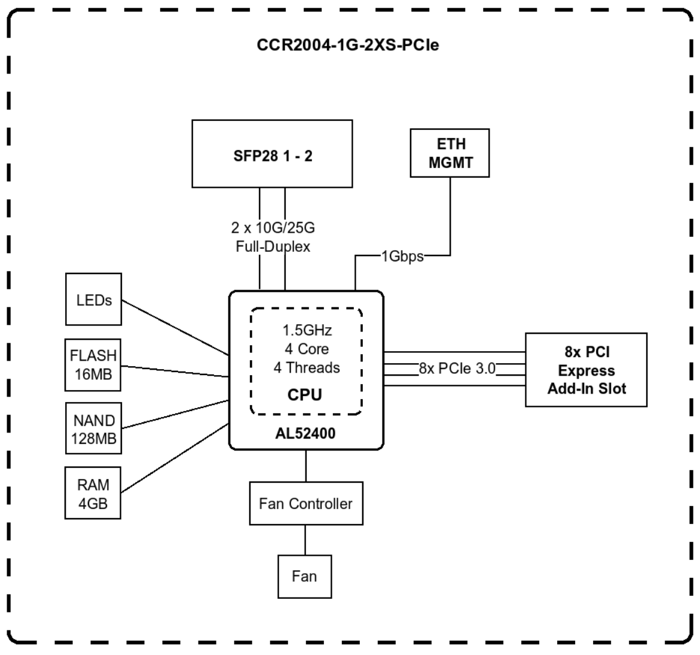
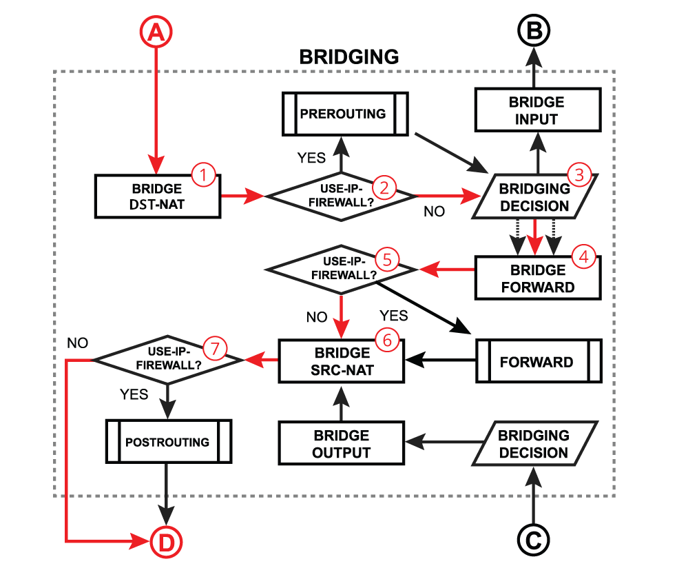
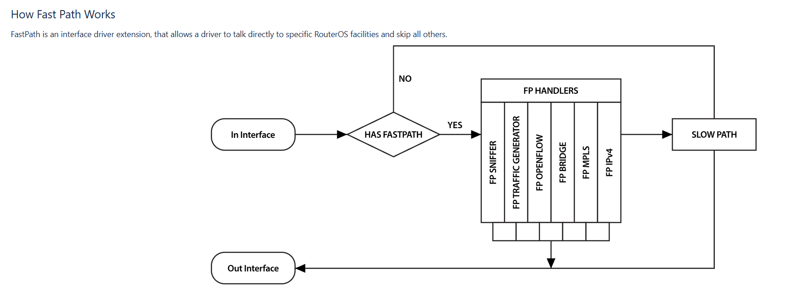
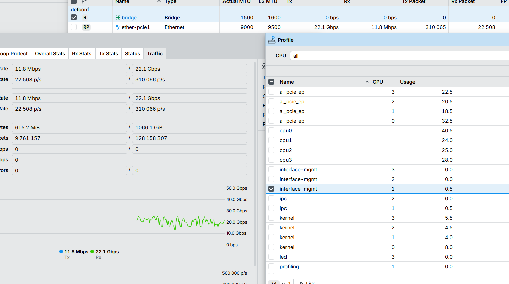
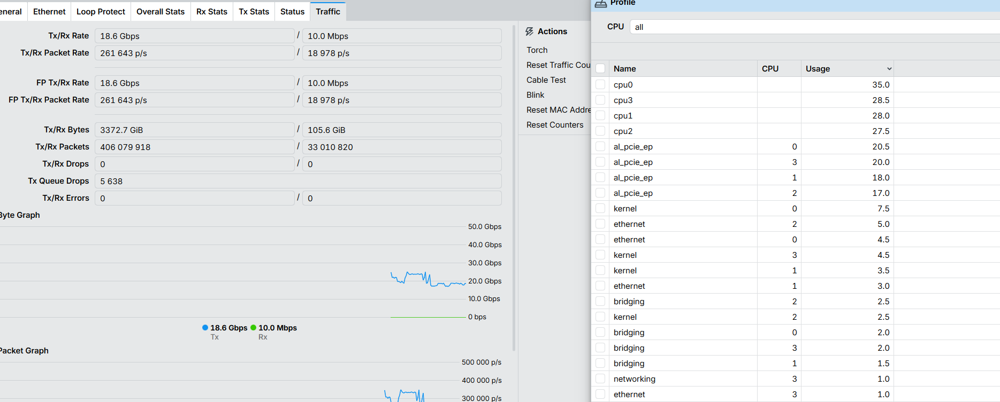
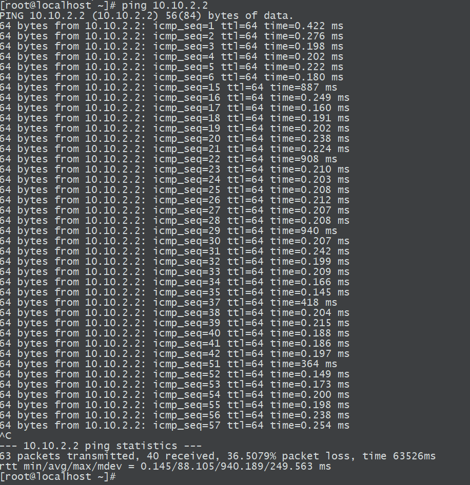
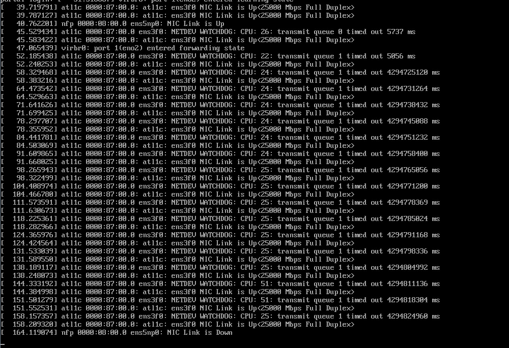

# CCR2004-1G-2XS-PCIe 一张软网卡

> 这是一款智能 PCIe网卡，可为您的服务器增加完整的路由器功能。如果您希望节省机房空间，它将是构建 25 Gigabit 网络的一种智能且简便的方案。

## 前言

**Mikrotik** 作为Bugos的研发公司，拉脱维亚小家电厂总是能给我带来许多惊喜。从最早的CCR10xx那一代 基于TILE 众核处理器，到如今的CCR2216 ARM+Switch Chip。（没错，这并不能算一台路由器。只能说是个大号的交换机）再加上bugos的疯狂漏路由。直到这个CCR2004 PCIE版本出来的时候，更是让我眼前一黑。

我本以为这会是个ARM+NIC的智能网卡，结果发现是纯粹的ARM，没有专门负责网卡的asic。




这种情况就意味着整个一个纯软结构，网卡的passthrough 是routeros通过fastpath将物理网口映射给host。而不是之前的PS225/BlueField这种直接将网口暴露。

```LENXY
                                                   Linux host
                                enpXsYf0    enpXsYf1      enpXsYf2    enpXsYf3
                                    │           │             │           │
                                    └──── PCIe 3.0 x8 / emulated NICs ────┘
                                                       |
                                               RouterOS on card
                                                       |
                                          ether-pcie1  -   ether-pcie4 
                                                       │
                                               sfp28-1 / sfp28-2
                                                       │
                                                  Physical wire
```

与想象中的不同，我最初以为Passthrough是通过两个网卡做bridge来实现的。但是官方的结果又给了不同的意见？


| Mode        | Configuration    | 1518 byte |         | 512 byte |        | 64 byte |        |
| ----------- | ---------------- | --------- | ------- | -------- | ------ | ------- | ------ |
|             |                  | kpps      | Mbps    | kpps     | Mbps   | kpps    | Mbps   |
| Passthrough | none (fast path) | 2341.4    | 28434   | 2349.6   | 9624.1 | 2339.3  | 1272.6 |
| Bridging    | none (fast path) | 1119.9    | 13600.1 | 1640.9   | 6721   | 2339.3  | 1272.6 |

## 不得不说的Fastpath

提到这里我们就不得不说提一下 routeros的fastpath。

由于没有 ASIC 硬件卸载，所有数据包（哪怕是 Passthrough）都需要经过这颗 ARM CPU  *AL52400*  进行软中断和内存拷贝。

所以为了避免太多无用的规则导致cpu转发性能不够。routeros开发了FastPath。

### RouterOS 的 Packet Flow 

先看一下包流转图




> Bridge forward 是指数据包从一个桥接口端口（bridge port）转发到桥中另一个端口的处理过程，本质上是用于在同一二层网络中连接多个设备。设备在 in-interface 上接收到数据包后，如果判断该接口属于桥端口，则该数据包会进入桥接处理流程（bridging process）：
>
> 1. 数据包首先会经过 bridge NAT 的 dst-nat chain。在这一阶段，可以修改目的 MAC 地址和优先级（priority）；除此之外，也可以对数据包执行accept、drop 或 mark 等操作。
> 2. 然后检查 bridge settings 中是否启用了 use-ip-firewall 选项。
> 3. 接着，数据包会通过 bridge host table 来做出转发决策。如果该数据包最终需要被泛洪（flooding）处理，例如属于广播（broadcast）、**组播（multicast）或未知单播（unknown unicast）**流量，那么它会按每个桥端口进行复制，然后继续在 bridge forward chain 中处理。
> 4. 当启用 vlan-filtering=yes 时，如果数据包根据 /interface bridge vlan 表的规则不被允许通过，那么会在这个阶段被丢弃。
> 5. 数据包随后会进入 bridge filter forward chain。在这里可以修改优先级，也可以直接对数据包执行accept、drop 或 mark。
> 6. 再次检查 bridge settings 中是否启用了 use-ip-firewall 选项。
> 7. 接下来，数据包会经过 bridge NAT 的 src-nat chain。在这一阶段，可以修改源 MAC 地址和优先级；同样也可以执行accept、drop 或 mark 等操作。
> 8. 最终检查 bridge settings 中是否启用了 use-ip-firewall 选项。

Fast Path则是将上面的路径尽可能缩短从而降低cpu使用率提高转发效率。



从进程中可以看出，开启passthrough模式是没有bridge这个进程的。说明此时只有al_pcie_ep在疯狂的负责将虚拟网卡和物理网卡数据流转。




> 看下来这个passthrough速率似乎不大能达标？ 我还没有详细的测是不是我另一端网卡的问题，这个咕咕咕一下后续再补吧

这个是启用bridge，比较明显的多了bridge进程。但由于仍是fastpath，所以性能似乎没差很多。（似乎启用桥接比passthrough更加稳定？这又什么为什么）




> 测试中断一下，我把routeros干死了 单独ping都有30%的丢包。4个al_pcie_ep只能拉起两个 事已至此只能重启看看了。






# 先写到这！等我从RHEL换到proxmox再测吧！！！！！！！！！！！！！！！！
