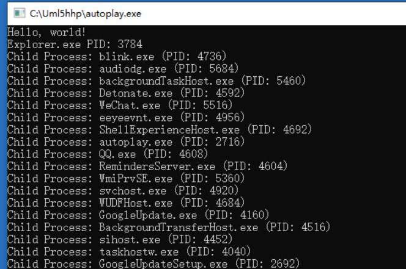
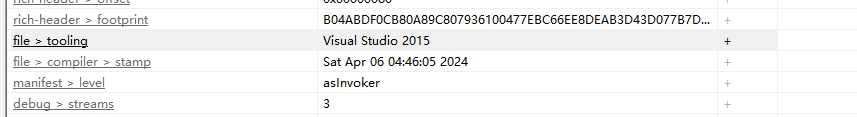
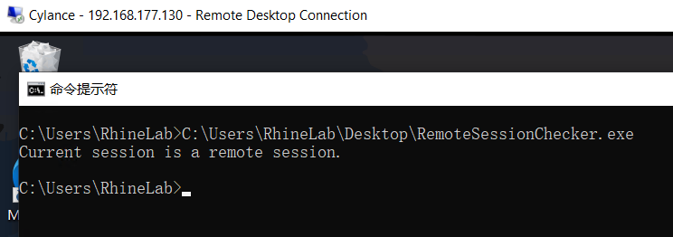

# 微步沙箱分析-Day2.5

> 这是Day2.5 用来总结一些奇淫艺技用的

## QQ内存大小判断法

之前有人说可以使用检查QQ内存大小来判断是否为微步沙箱

于是我们来测试下看看 糊了一个程序

```rust
use std::process::Command;
use sysinfo::{System};
fn main() {
    println!("Hello, world!");
    let s = System::new_all();
    for (_pid,process) in s.processes(){
        let process_name = process.name();
        if process_name == "QQ.exe" {
            println!("Process name is {} Memory is {}",process_name,process.memory())
        }
    }
    let _ = Command::new("cmd.exe").arg("/c").arg("pause").status();
}

```


结果是可行的，QQ只存在单进程且仅有2MB.且通过这个方法似乎可以使微步执行超时？

喂了避免使用CreateToolhelp32Snapshot造成沙箱生成遍历进程的指标.在这里用到了sysinfo

## 子进程判断法



微步会把奇奇怪怪的进程都塞给Explorer.exe 所以可以通过这个方法简易的判断一下


## CPU判断

```rust
use std::process::Command;
use raw_cpuid::CpuId;

fn main() {
    // 创建 CPUID 对象
    let cpuid = CpuId::new();

    // 查询 CPU 型号和制造商信息
    if let Some(brand_string) = cpuid.get_processor_brand_string()
    {
        println!("CPU 型号: {}", brand_string.as_str());
    } else {
        println!("无法获取 CPU 型号信息");
    }
    if let Some(feature_info) = cpuid.get_feature_info() {
        if feature_info.has_vmx() || feature_info.has_avx() {
            println!("CPU 支持虚拟化");
        } else {
            println!("CPU 不支持虚拟化");
        }
    } else {
        println!("无法获取 CPU 特性信息");
    }
    let _ = Command::new("cmd.exe").arg("/c").arg("pause").status();
}

```


## 来看看样本吧  未完待续（ 打群星去了



也不知道是不是上次那哥们传的 就用这个分析以下看看吧

### 反调试

```c
  if ( IsDebuggerPresent() )   //检测当前进程是否正在被调试器调试
    goto LABEL_2;
  pbDebuggerPresent = 0;
  CurrentProcess = GetCurrentProcess();
  if ( CheckRemoteDebuggerPresent(CurrentProcess, &pbDebuggerPresent) )   //检测是否正在被远程调试器调试
  {
    if ( pbDebuggerPresent )
      goto LABEL_2;
  }
```

糊一个调试器的测试代码吧 远程调试器就不写了

```rust
extern crate winapi;

use winapi::um::winuser::IsDebuggerPresent;

fn main() {
    let debugger_present = unsafe { IsDebuggerPresent() };
    if debugger_present != 0 {
        println!("Debugger is present.");
    } else {
        println!("Debugger is not present.");
    }
}
```

### 判断是否为远程链接

```c
  if ( GetSystemMetrics(4096) )
    goto LABEL_2;
```

通过**GetSystemMetrics(SM_REMOTESESSION)**来判断是否为远程桌面.

```rust
extern crate winapi;

use winapi::um::winuser::GetSystemMetrics;

fn main() {
    let remote_session = unsafe { GetSystemMetrics(4096) };
    if remote_session != 0 {
        println!("Current session is a remote session.");
    } else {
        println!("Current session is not a remote session.");
    }
}
```



