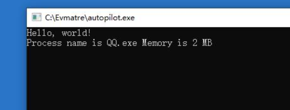

# 微步沙箱分析-Day2.5

> 这是Day2.5 用来总结一些奇淫艺技用的

之前有人说可以使用检查QQ内存大小来判断是否为微步沙箱

于是我们来测试下看看 糊了一个程序

```rust
use std::process::Command;
use sysinfo::{System};
fn main() {
    println!("Hello, world!");
    let s = System::new_all();
    for (_pid,process) in s.processes(){
        let process_name = process.name();
        if process_name == "QQ.exe" {
            println!("Process name is {} Memory is {}",process_name,process.memory())
        }
    }
    let _ = Command::new("cmd.exe").arg("/c").arg("pause").status();
}

```



结果是可行的，QQ只存在单进程且仅有2MB.且通过这个方法似乎可以使微步执行超时？

## 未完待续（ 打群星去了
