# 微步沙箱分析-Day2

这篇文章的兴趣来源是某位大哥在疯狂的上传SandboxChecker,所以我来按时间分析一下他的实验成果.

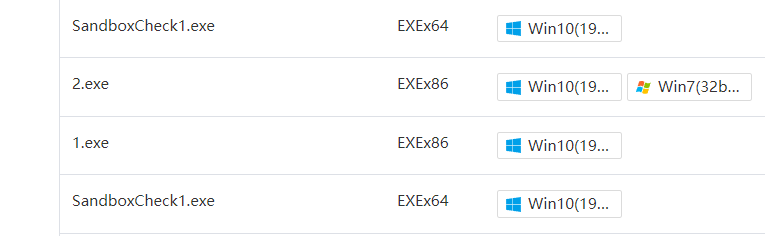

## SandboxChecker V1.0

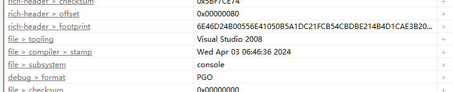

大概是最初的版本,只检测了CPU制造商和是否支持SSE

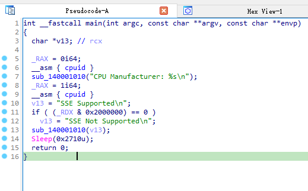

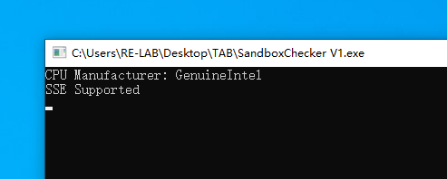

## SandboxChecker V1.1

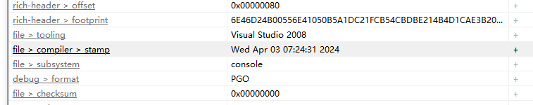

在经过40分钟后,又上传了新的SandboxChecker 我称之为V1.1 小版本号更新一下吧 虽然功能完全不一致

V1.1版本则开始试图读取虚拟化信息了.

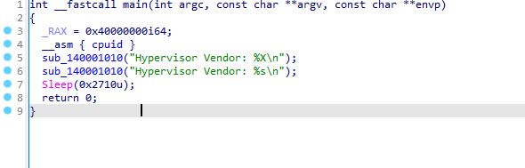

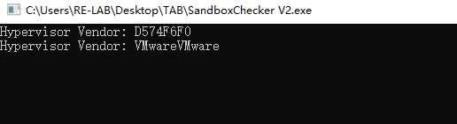

但是这种检测方式还是比较容易绕过的Like:

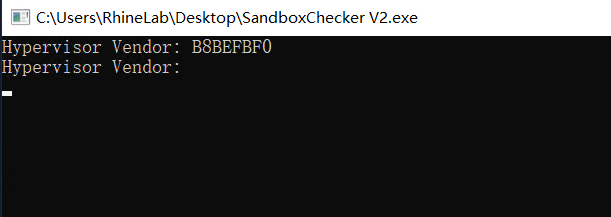

所以相对来说针对沙箱是无效的,所以我们来看一看更新的版本

## SandboxChecker V1.1.1

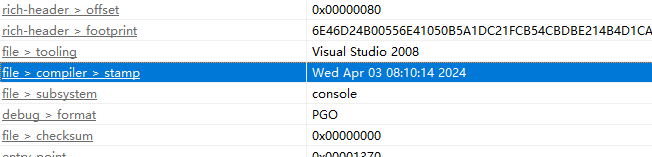

哦,好吧. 我准备将V1.2版本号更改成V1.1.1 因为这个跟V1.1基本没有什么区别 只是改了一点点输出

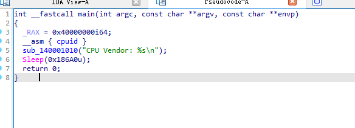

> 注:当 RAX 寄存器被设置为 0x40000000 时 CPUID 返回的信息是 "VMXh"（Virtual Machine eXtensions）这些信息用于检测 CPU 是否支持虚拟化技术。

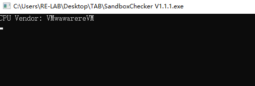

附代码:

```c++
#include <iostream>
#include <cstring>

void cpuid(unsigned int op, unsigned int *eax, unsigned int *ebx, unsigned int *ecx, unsigned int *edx) {
    __asm__(
            "cpuid;"
            : "=a" (*eax), "=b" (*ebx), "=c" (*ecx), "=d" (*edx)
            : "a" (op)
            );
}

int main() {
    unsigned int eax, ebx, ecx, edx;

    // 查询扩展的 CPUID 信息
    cpuid(0x40000000, &eax, &ebx, &ecx, &edx);

    char signature[13] = {0};
    memcpy(&signature[0], &ebx, 4);
    memcpy(&signature[4], &ecx, 4);
    memcpy(&signature[8], &edx, 4);

    std::cout << "VMXh: " << signature << std::endl;

    return 0;
}

```


## SandboxChecker V1.2

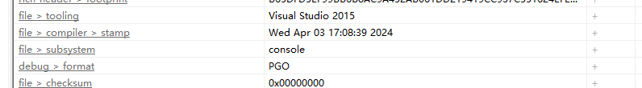

在历时8个小时后 又开始了新的尝试.本次代码变动比较大(我挺想叫他V2.0的)

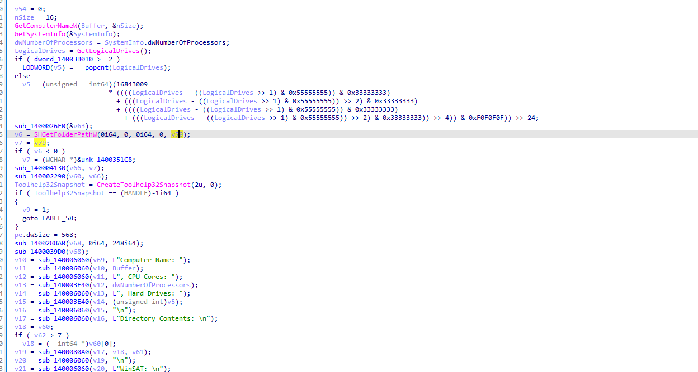

开始获取计算机名称,系统信息,磁盘信息.并且会遍历`C:\Windows\Performance\WinSAT\DataStore\*`下所有文件 

通过`CreateToolhelp32Snapshot`创建进程快照来遍历进程, 随后将获取到的信息发送至`117.50.179.15:8086`

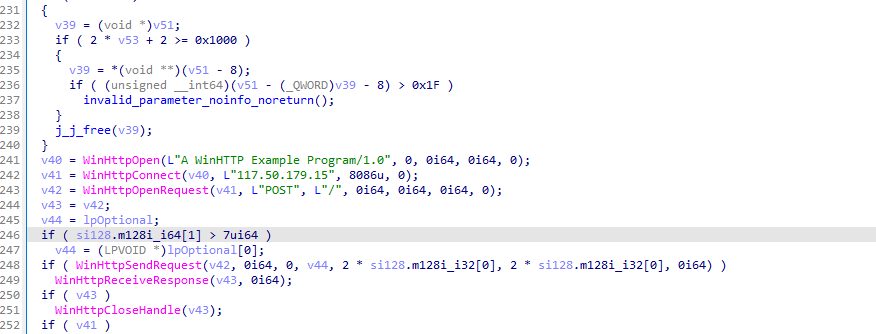

抓包后内容:

```
systemInfo=Computer Name: DESKTOP-H9URB7T, CPU Cores: 4, Hard Drives: 2
Directory Contents: 
desktop.ini
Microsoft Edge.lnk

WinSAT: 
2021-01-26 03.06.25.993.winsat.etl
2021-01-26 03.06.26.712 Cpu.Assessment (Initial).WinSAT.xml
2021-01-26 03.06.26.712 Disk.Assessment (Initial).WinSAT.xml
2021-01-26 03.06.26.712 DWM.Assessment (Initial).WinSAT.xml
2021-01-26 03.06.26.712 Graphics3D.Assessment (Initial).WinSAT.xml
2021-01-26 03.06.26.712 Mem.Assessment (Initial).WinSAT.xml
2021-01-26 03.08.10.544 Formal.Assessment (Initial).WinSAT.xml

Process Name: [System Process], PID: 0
Process Name: System, PID: 4
Process Name: Registry, PID: 96
Process Name: smss.exe, PID: 324
Process Name: csrss.exe, PID: 440
Process Name: wininit.exe, PID: 516
Process Name: csrss.exe, PID: 524
Process Name: winlogon.exe, PID: 616
Process Name: services.exe, PID: 660
Process Name: lsass.exe, PID: 680
Process Name: svchost.exe, PID: 792
Process Name: svchost.exe, PID: 816
Process Name: fontdrvhost.exe, PID: 836
Process Name: fontdrvhost.exe, PID: 844
Process Name: svchost.exe, PID: 924
Process Name: svchost.exe, PID: 988
Process Name: dwm.exe, PID: 352
Process Name: svchost.exe, PID: 508
Process Name: svchost.exe, PID: 812
Process Name: svchost.exe, PID: 656
Process Name: svchost.exe, PID: 1088
Process Name: svchost.exe, PID: 1096
Process Name: svchost.exe, PID: 1160
Process Name: svchost.exe, PID: 1164
Process Name: svchost.exe, PID: 1184
Process Name: svchost.exe, PID: 1236
Process Name: svchost.exe, PID: 1296
Process Name: svchost.exe, PID: 1348
Process Name: svchost.exe, PID: 1380
Process Name: svchost.exe, PID: 1392
Process Name: svchost.exe, PID: 1416
Process Name: svchost.exe, PID: 1452
Process Name: svchost.exe, PID: 1516
Process Name: svchost.exe, PID: 1648
Process Name: svchost.exe, PID: 1696
Process Name: svchost.exe, PID: 1708
Process Name: svchost.exe, PID: 1720
Process Name: svchost.exe, PID: 1812
Process Name: svchost.exe, PID: 1824
Process Name: svchost.exe, PID: 1900
Process Name: svchost.exe, PID: 1932
Process Name: spoolsv.exe, PID: 1116
Process Name: audiodg.exe, PID: 720
Process Name: svchost.exe, PID: 1512
Process Name: svchost.exe, PID: 2052
Process Name: svchost.exe, PID: 2132
Process Name: svchost.exe, PID: 2180
Process Name: svchost.exe, PID: 2536
Process Name: svchost.exe, PID: 2544
Process Name: svchost.exe, PID: 2552
Process Name: svchost.exe, PID: 2560
Process Name: AcrylicService.exe, PID: 2568
Process Name: svchost.exe, PID: 2576
Process Name: svchost.exe, PID: 2584
Process Name: svchost.exe, PID: 2628
Process Name: svchost.exe, PID: 2804
Process Name: svchost.exe, PID: 3056
Process Name: svchost.exe, PID: 752
Process Name: sppsvc.exe, PID: 2508
Process Name: SppExtComObj.Exe, PID: 760
Process Name: svchost.exe, PID: 3084
Process Name: svchost.exe, PID: 3196
Process Name: svchost.exe, PID: 3328
Process Name: sihost.exe, PID: 3572
Process Name: svchost.exe, PID: 3596
Process Name: svchost.exe, PID: 3772
Process Name: ctfmon.exe, PID: 3860
Process Name: taskhostw.exe, PID: 3900
Process Name: explorer.exe, PID: 3188
Process Name: svchost.exe, PID: 3692
Process Name: svchost.exe, PID: 3724
Process Name: ChsIME.exe, PID: 3648
Process Name: svchost.exe, PID: 4212
Process Name: StartMenuExperienceHost.exe, PID: 4220
Process Name: svchost.exe, PID: 4256
Process Name: RuntimeBroker.exe, PID: 4416
Process Name: ApplicationFrameHost.exe, PID: 4716
Process Name: MicrosoftEdge.exe, PID: 4736
Process Name: browser_broker.exe, PID: 4844
Process Name: svchost.exe, PID: 4944
Process Name: dllhost.exe, PID: 5020
Process Name: Windows.WARP.JITService.exe, PID: 5028
Process Name: RuntimeBroker.exe, PID: 3804
Process Name: MicrosoftEdgeCP.exe, PID: 4352
Process Name: MicrosoftEdgeSH.exe, PID: 4496
Process Name: WindowsInternal.ComposableShell.Experiences.TextInput.InputApp.exe, PID: 5284
Process Name: WeChat.exe, PID: 5544
Process Name: taskhostw.exe, PID: 5932
Process Name: svchost.exe, PID: 6068
Process Name: TrustedInstaller.exe, PID: 6132
Process Name: svchost.exe, PID: 3468
Process Name: usocoreworker.exe, PID: 5564
Process Name: TiWorker.exe, PID: 5732
Process Name: svchost.exe, PID: 5492
Process Name: svchost.exe, PID: 668
Process Name: WmiPrvSE.exe, PID: 4796
Process Name: WmiPrvSE.exe, PID: 3916
Process Name: svchost.exe, PID: 4952
Process Name: svchost.exe, PID: 6028
Process Name: WeChat.exe, PID: 6092
Process Name: PWTXIkBXCb.exe, PID: 2432
Process Name: unsecapp.exe, PID: 3608
Process Name: ShellExperienceHost.exe, PID: 2204
Process Name: svchost.exe, PID: 4004
Process Name: persfw.exe, PID: 3212
Process Name: svchost.exe, PID: 2636
Process Name: QQ.exe, PID: 3524
Process Name: SafeDogGuardCenter.exe, PID: 5984
Process Name: sihost.exe, PID: 1848
Process Name: backgroundTaskHost.exe, PID: 2824
Process Name: Detonate.exe, PID: 5812
Process Name: BgackgroundTransferHost.exe, PID: 5040
Process Name: RemindersServer.exe, PID: 3884
Process Name: vba32lder.exe, PID: 5612
Process Name: wrctrl.exe, PID: 1336
Process Name: safedog.exe, PID: 6032
Process Name: SafeDogSiteIIS.exe, PID: 5652
Process Name: SafeDogServerUI.exe, PID: 1948
Process Name: GoogleUpdate.exe, PID: 5856
Process Name: audiodg.exe, PID: 4312
Process Name: taskhostw.exe, PID: 2640
Process Name: WUDFHost.exe, PID: 1524
Process Name: SafeDogGuardCenter.exe, PID: 5188
Process Name: WmiPrvSE.exe, PID: 6064
Process Name: GoogleUpdateSetup.exe, PID: 6004
Process Name: SafeDogTray.exe, PID: 2652
Process Name: safedogupdatecenter.exe, PID: 4988
Process Name: svchost.exe, PID: 1924
Process Name: ShellExperienceHost.exe, PID: 672
Process Name: RuntimeBroker.exe, PID: 6184
Process Name: svchost.exe, PID: 6996
Process Name: SandboxCheck.exe, PID: 6352
Process Name: conhost.exe, PID: 6312

```

> 以下内容为奇思妙想内容

WinSAT的信息似乎不会改变,是不是可以通过比对哈希来查看是否为微步虚拟机呢?

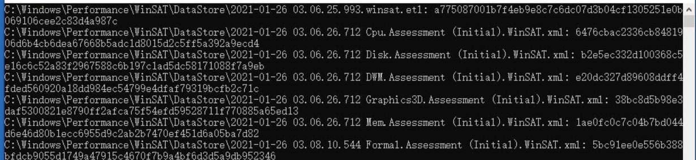


## SandboxChecker V1.2.1

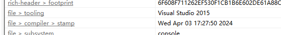

间隔20分钟的程序,只是多了个打开计算器`ShellExecuteW(0i64, L"open", L"calc.exe", 0i64, 0i64, 1);`

查询作者精神状态,,,,


## SandboxChecker V1.3.0

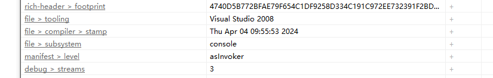

在历时一天后,作者似乎发现了新的大陆.但是为什么要切换到VS2008啊 我不能理解(

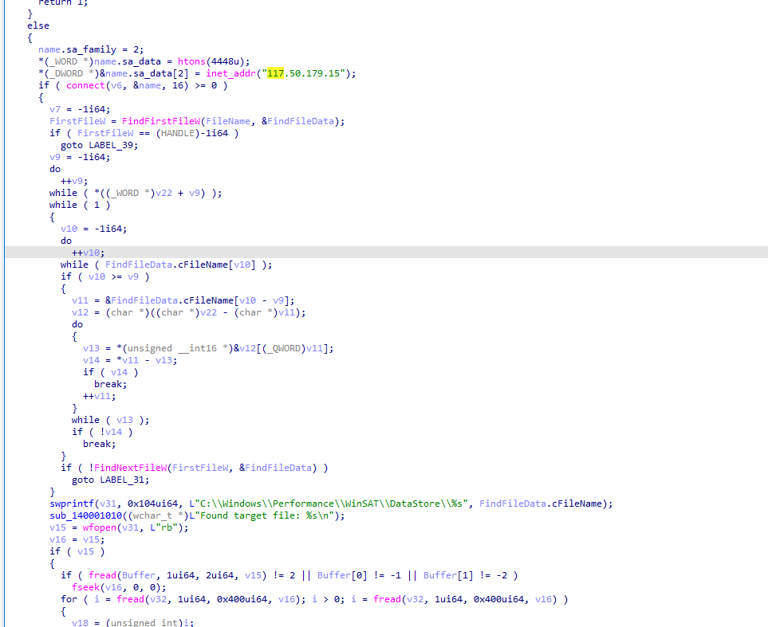

对的 作者开始察觉`C:\Windows\Performance\WinSAT\DataStore\`隐藏着秘密,所以专门写了一个测试文件去检查目标文件是否存在并且回传到`117.50.179.15:4448`

## SandboxChecker V1.3.1

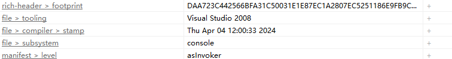

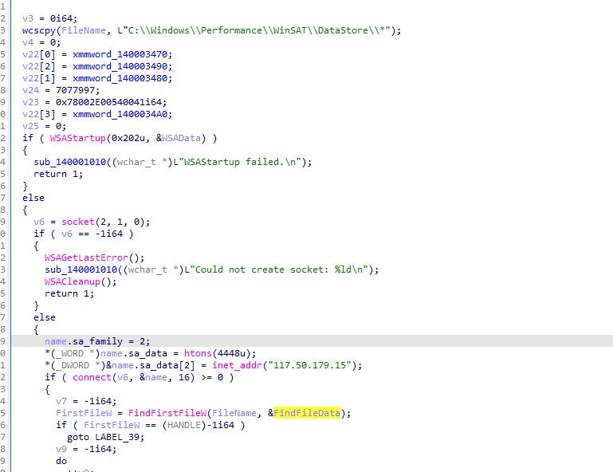

变化不大,简单的水一下过去了.

## SandboxChecker V1.3.2

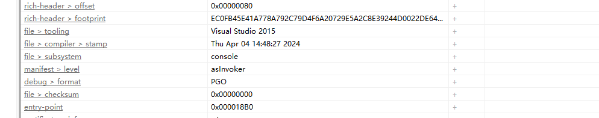

VS版本切换到了2015 看起来还在Debug程序的上传功能?

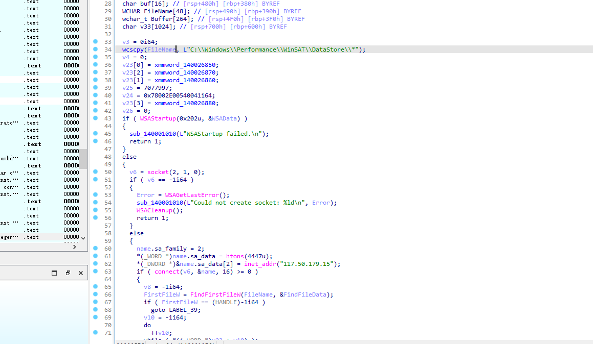

回传变更成了`117.50.179.15:4447`

## SandboxChecker V1.3.3

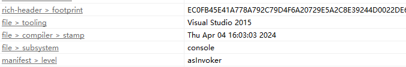

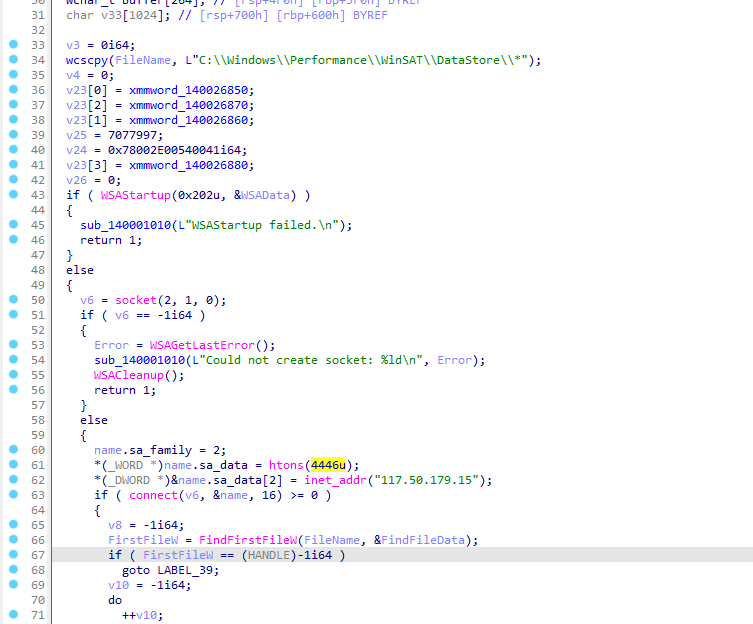

回传变更成了`117.50.179.15:4446`

## SandboxChecker V1.4.0

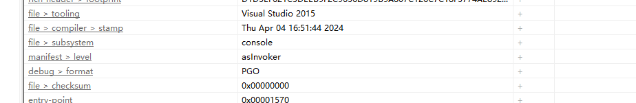

1.4.0版本开始进军全新版本了

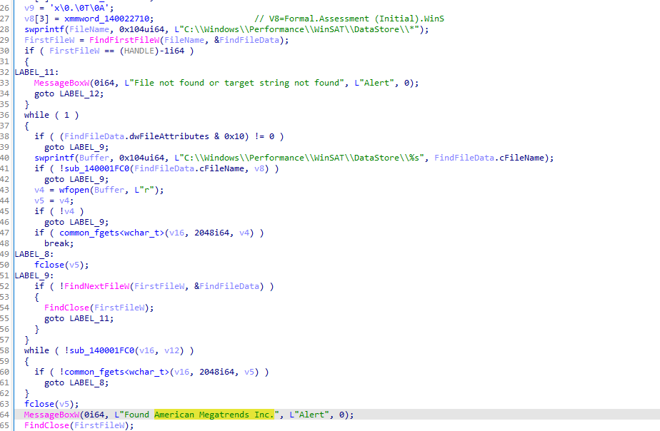

开始搜寻是否存在`Formal.Assessment (Initial).WinS`的文件与此文件中是否包含 `American Megatrends Inc.`

如果存在则弹窗提示American Megatrends Inc.如果没有则打开计算器.

## SandboxChecker V1.5.0   4月7日追踪更新版

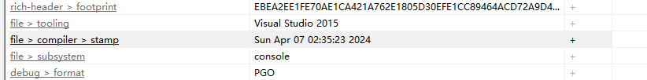

凌晨两点,这小哥真的不睡觉的吗 功能变化不大,似乎与V1.2.0版本差不多,除了新增一个打开计算器

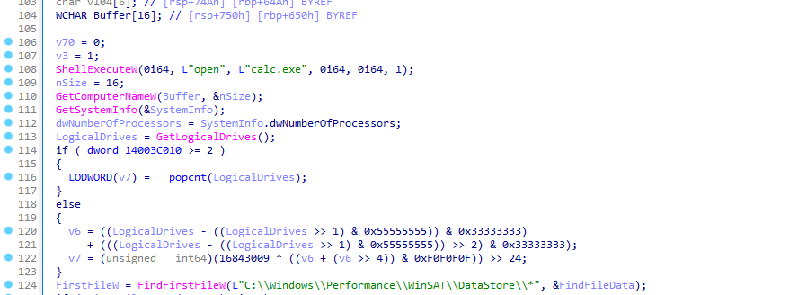

信息发送至`117.50.179.15:8086`

```
systemInfo=Computer Name: DESKTOP-H9URB7T, CPU Cores: 4, Hard Drives: 2
Directory Contents: 
desktop.ini
Microsoft Edge.lnk

WinSAT: 
2021-01-26 03.06.25.993.winsat.etl
2021-01-26 03.06.26.712 Cpu.Assessment (Initial).WinSAT.xml
2021-01-26 03.06.26.712 Disk.Assessment (Initial).WinSAT.xml
2021-01-26 03.06.26.712 DWM.Assessment (Initial).WinSAT.xml
2021-01-26 03.06.26.712 Graphics3D.Assessment (Initial).WinSAT.xml
2021-01-26 03.06.26.712 Mem.Assessment (Initial).WinSAT.xml
2021-01-26 03.08.10.544 Formal.Assessment (Initial).WinSAT.xml

网卡信息:
Realtek RTL8139C+ Fast Ethernet NIC

开启窗口数量:
6
Process Name: [System Process], PID: 0
Process Name: System, PID: 4
Process Name: Registry, PID: 96
Process Name: smss.exe, PID: 324
Process Name: csrss.exe, PID: 444
Process Name: wininit.exe, PID: 520
Process Name: csrss.exe, PID: 568
Process Name: winlogon.exe, PID: 620
Process Name: services.exe, PID: 660
Process Name: lsass.exe, PID: 684
Process Name: svchost.exe, PID: 796
Process Name: svchost.exe, PID: 820
Process Name: fontdrvhost.exe, PID: 840
Process Name: fontdrvhost.exe, PID: 848
Process Name: svchost.exe, PID: 940
Process Name: svchost.exe, PID: 992
Process Name: dwm.exe, PID: 348
Process Name: svchost.exe, PID: 360
Process Name: svchost.exe, PID: 696
Process Name: svchost.exe, PID: 1060
Process Name: svchost.exe, PID: 1072
Process Name: svchost.exe, PID: 1108
Process Name: svchost.exe, PID: 1184
Process Name: svchost.exe, PID: 1232
Process Name: svchost.exe, PID: 1272
Process Name: svchost.exe, PID: 1280
Process Name: svchost.exe, PID: 1312
Process Name: svchost.exe, PID: 1320
Process Name: svchost.exe, PID: 1412
Process Name: svchost.exe, PID: 1440
Process Name: svchost.exe, PID: 1464
Process Name: svchost.exe, PID: 1500
Process Name: svchost.exe, PID: 1536
Process Name: svchost.exe, PID: 1564
Process Name: svchost.exe, PID: 1656
Process Name: svchost.exe, PID: 1756
Process Name: svchost.exe, PID: 1824
Process Name: svchost.exe, PID: 1840
Process Name: audiodg.exe, PID: 1980
Process Name: svchost.exe, PID: 1992
Process Name: svchost.exe, PID: 2044
Process Name: svchost.exe, PID: 1192
Process Name: svchost.exe, PID: 1432
Process Name: spoolsv.exe, PID: 2148
Process Name: svchost.exe, PID: 2244
Process Name: svchost.exe, PID: 2276
Process Name: svchost.exe, PID: 2476
Process Name: svchost.exe, PID: 2484
Process Name: svchost.exe, PID: 2492
Process Name: AcrylicService.exe, PID: 2500
Process Name: svchost.exe, PID: 2536
Process Name: svchost.exe, PID: 2564
Process Name: svchost.exe, PID: 2580
Process Name: svchost.exe, PID: 2592
Process Name: svchost.exe, PID: 2752
Process Name: svchost.exe, PID: 3020
Process Name: svchost.exe, PID: 2412
Process Name: svchost.exe, PID: 352
Process Name: svchost.exe, PID: 3084
Process Name: sihost.exe, PID: 3324
Process Name: svchost.exe, PID: 3352
Process Name: svchost.exe, PID: 3488
Process Name: ctfmon.exe, PID: 3520
Process Name: taskhostw.exe, PID: 3576
Process Name: explorer.exe, PID: 3792
Process Name: sppsvc.exe, PID: 3916
Process Name: svchost.exe, PID: 3984
Process Name: svchost.exe, PID: 4060
Process Name: ChsIME.exe, PID: 4080
Process Name: SppExtComObj.Exe, PID: 3956
Process Name: StartMenuExperienceHost.exe, PID: 4120
Process Name: svchost.exe, PID: 4128
Process Name: svchost.exe, PID: 4160
Process Name: svchost.exe, PID: 4248
Process Name: RuntimeBroker.exe, PID: 4368
Process Name: ApplicationFrameHost.exe, PID: 4672
Process Name: MicrosoftEdge.exe, PID: 4692
Process Name: browser_broker.exe, PID: 4816
Process Name: svchost.exe, PID: 4892
Process Name: dllhost.exe, PID: 4972
Process Name: Windows.WARP.JITService.exe, PID: 4984
Process Name: RuntimeBroker.exe, PID: 5088
Process Name: MicrosoftEdgeSH.exe, PID: 4428
Process Name: MicrosoftEdgeCP.exe, PID: 4460
Process Name: WindowsInternal.ComposableShell.Experiences.TextInput.InputApp.exe, PID: 5264
Process Name: WeChat.exe, PID: 5536
Process Name: taskhostw.exe, PID: 5960
Process Name: svchost.exe, PID: 6120
Process Name: svchost.exe, PID: 4916
Process Name: TrustedInstaller.exe, PID: 5644
Process Name: TiWorker.exe, PID: 5500
Process Name: svchost.exe, PID: 2600
Process Name: WmiPrvSE.exe, PID: 4744
Process Name: WmiPrvSE.exe, PID: 6076
Process Name: WeChat.exe, PID: 5992
Process Name: svchost.exe, PID: 3940
Process Name: svchost.exe, PID: 5592
Process Name: MjUVfuNpXl.exe, PID: 1348
Process Name: unsecapp.exe, PID: 2896
Process Name: Detonate.exe, PID: 1372
Process Name: svchost.exe, PID: 1260
Process Name: GoogleUpdateSetup.exe, PID: 5244
Process Name: clamd.exe, PID: 1612
Process Name: svchost.exe, PID: 1684
Process Name: taskhostw.exe, PID: 2552
Process Name: RemindersServer.exe, PID: 2432
Process Name: backgroundTaskHost.exe, PID: 1936
Process Name: UniversalAVService.exe, PID: 4196
Process Name: audiodg.exe, PID: 1424
Process Name: EverythingServer.exe, PID: 4336
Process Name: WUDFHost.exe, PID: 4840
Process Name: GoogleUpdate.exe, PID: 5892
Process Name: WeChat.exe, PID: 3236
Process Name: sihost.exe, PID: 5200
Process Name: WmiPrvSE.exe, PID: 5192
Process Name: QQ.exe, PID: 2720
Process Name: ShellExperienceHost.exe, PID: 3244
Process Name: BackgroundTransferHost.exe, PID: 5520
Process Name: svchost.exe, PID: 5104
Process Name: ShellExperienceHost.exe, PID: 2548
Process Name: RuntimeBroker.exe, PID: 4240
Process Name: svchost.exe, PID: 5928
Process Name: SandboxCheck.exe, PID: 448
Process Name: conhost.exe, PID: 2272
Process Name: svchost.exe, PID: 4348
Process Name: calc.exe, PID: 464

```


## END

就此似乎结束了 他没有更新新的东西

他似乎发现了绕过微步的小技巧,但是总感觉这个技巧有点灵车)
