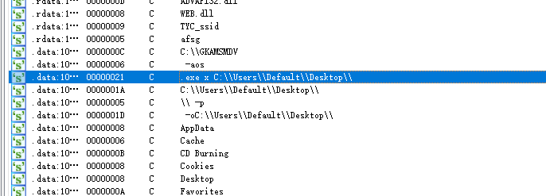

# FakeApp 远控执行分析

又来啦又来啦，让我们来看看今天的FakeApp能给我带来什么样的惊喜呢！

今日受害者 LINE


面对这种程序，我一直没有分析思路。如何去直接提取他的文件（或许可以丢给binwalk看看？（（好像不行

## 样本提取

既然没法通过特殊手段提取这个样本，不如走点正常的流程，直接执行随后用`Process Monitor`对行为进行监控。

由于是之查看文件的行为，所以限定条件变成了进程名和新建文件。从这里就能抓到一个文件LINK.msi


既然有LINK.MSI，我们就可以看一下她后续的操作了


Cab也找到了，剩下的可以直接解压Link1.cab查看文件了。


第一眼看到exe和俩dll时，我还开心的以为是白加黑，可惜情况并不如我所愿 `b1b86e6fd9.OIL`/`d0437f784fad.LLL`/`dd5c0d72bf.SIJ`为三个压缩包（有密码

exe和z.dll是7zip。所以似乎可以把目光转向WEB.dll这个倒霉蛋了


## 半成品分析的WEB.dll

这里还得感谢DI，WEB.dll刚落地就给扬了


大致思路也清晰了，开始转向WEB.dll。由于我逆向一直是半斤八两，索性直接看String里有什么了



很好，很有精神。找到了个路径，看起来像是拼接行为。随后接着研究吧


通过内容来看是从GKAMSMDV中读取XYL项，打开发现是个Vmware桥接的配置信息，但是里面多了自定义项XLY


随后往下翻阅，可以看到又是在构造语句


好了，可以确定构造内容了

有部分路径没找到，所以又用到了。。。Process monitor查看

```
例
C:\Users\Default\Desktop\(P0)LNKNEW\(P1)588388456db280daIJE.exe x C:\Users\Default\Desktop\(P0)LNKNEW\(P2)d0437f784fad.LLL -o(干，这个路径没找到哪来的 烦)C:\Users\RhineLab\AppData\ -p(P3)0795ea6f59475671GHB -aos
```


文件提取完成


## 流程图

好好好！分析到这里就差不多了，写个流程图吧。是在肝不动了。挖坑下次继续 

> 样本留存 #7004665f20293bc4d74b39ddc922c6668d9df803.zip


