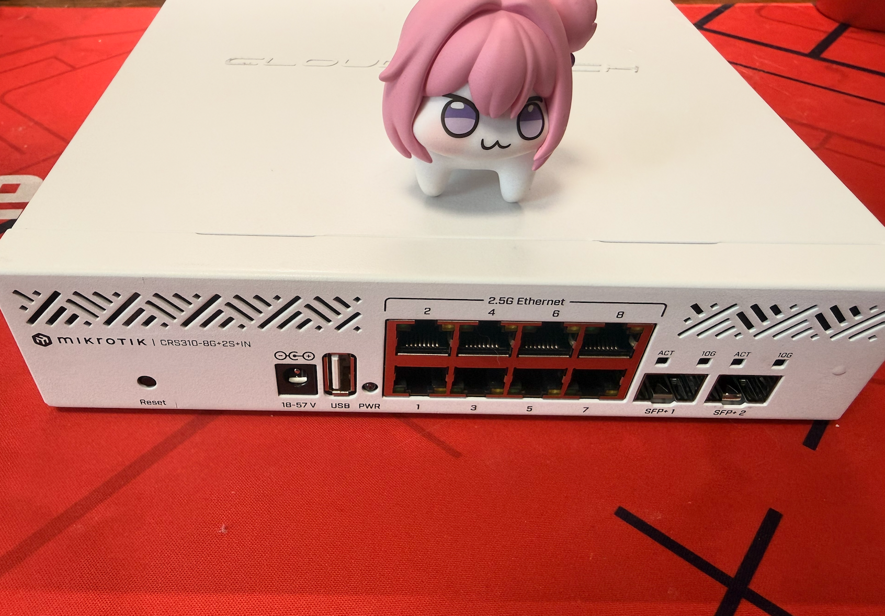
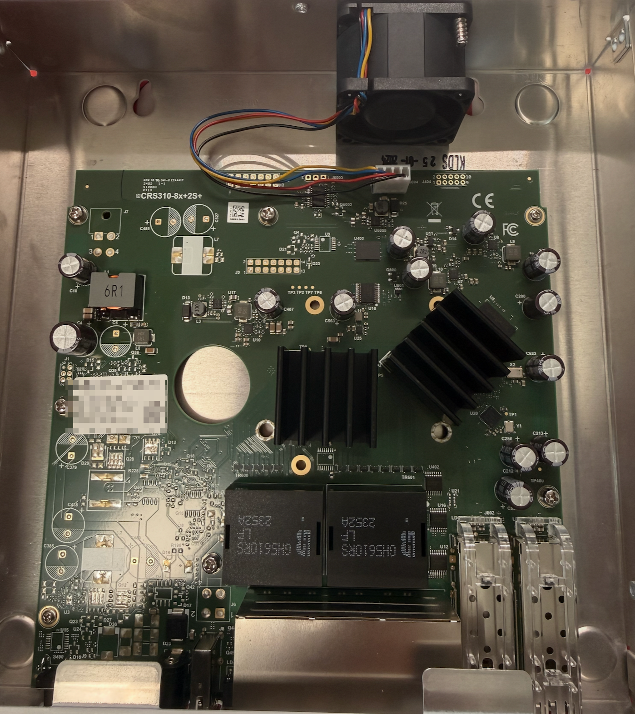
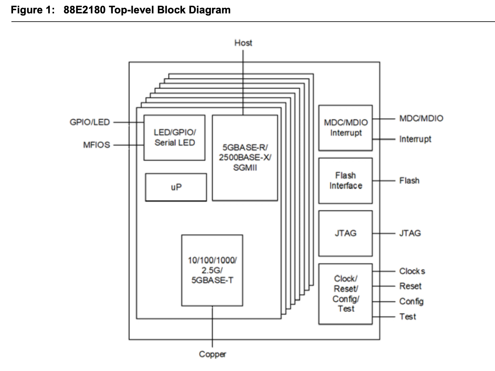
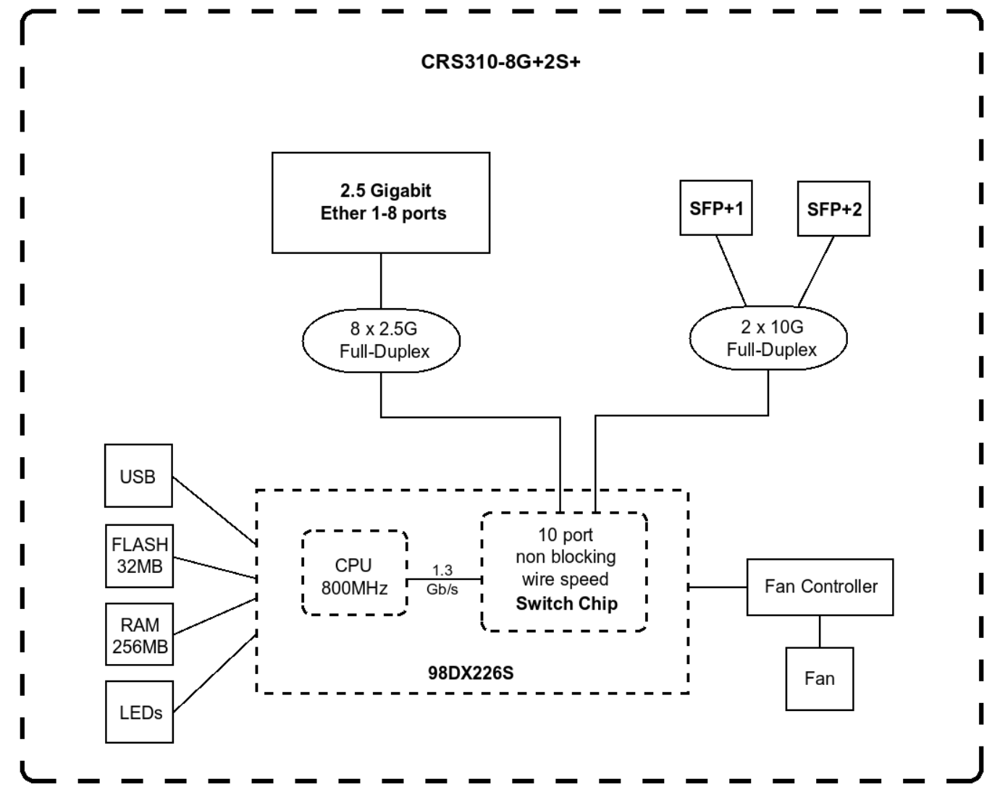
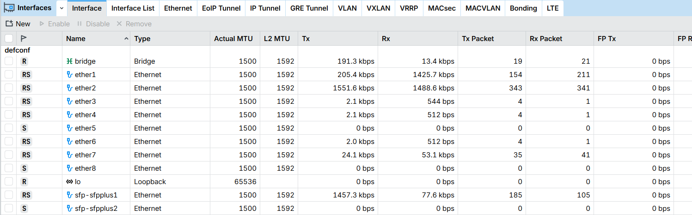
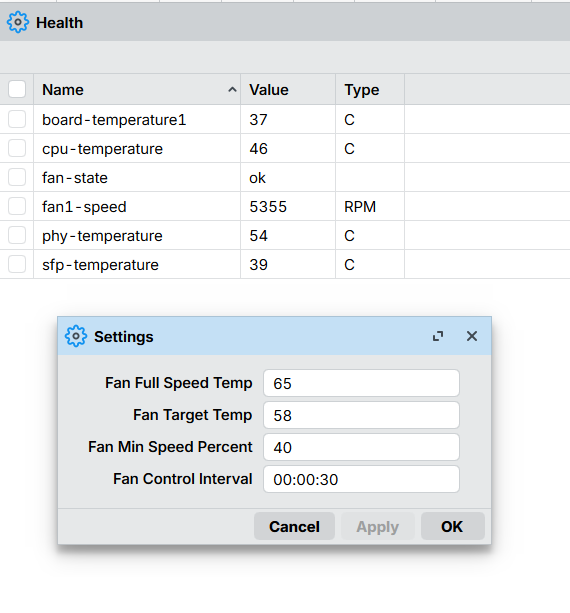

# Wow Mikrotik的2.5G交换机！

最近由于我的稀客交换机（sks3200-8e1x）在升级后暴毙，我就没有靠谱的2.5G交换机可以用了。

之前稀客交换机间歇性管理平面会宕机，只保留了转发平面。我觉得管理平面宕机我能接受但是稀客神奇的策略会使dhcp包无法正常转发，以至于家里所有移动设备都暴毙了。后来从官方要了新的固件包，升级后更是直接暴毙无法开机。至此我再也不玩这种灵车交换机了。

机缘巧合之下（哇 咸鱼有特价），我买下了这款CRS310-8G+2S+IN的交换机。

## 看看内部图

下图被挡住的是机器的信息，Mikrotik的新设备已经启用了随机密码策略。密码将会被贴在盒子/说明书/机箱/主板这四个地方。如果都丢了你只能去找经销商查询

内部结构算得上比较简陋了，大量未贴片的焊盘（估计是为了日后推出其他版本用的）一共有两个散热片，网变后面的散热片下面压的是Marvell 88E2180 8口5速的PHY。（Mikrotik 我的5G呢！）

而另一个斜着放置的就是这块交换机的核心 Marvell 98DX226S  带双核ARM 800Mghz 的交换芯片

来看一下简略的架构图，256M的RAM 32M的Flash(该说不说ROS是真小啊，32M就能跑了)。8口的2.5G被单独画出来了，估计是因为有PHY的缘故。而不是直接被拉到SOC里面。

## 使用

至于后续的配置就没什么好讲的了，毕竟就是纯粹用来当二层交换机用。插满看起来的效果还是不错的。

还有一个问题是需要注意的风扇最好自己换了，它默认的风扇真的是能吵死。以及有能力的话可以将PHY与SOC的散热片都换掉。默认的甚至出现了没有散热介质，直接把散热片放上去的情况。

