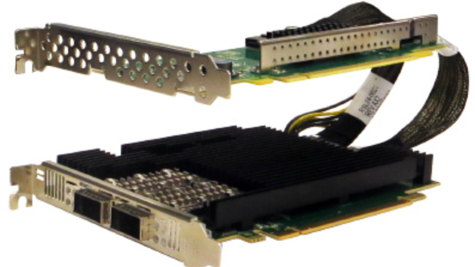
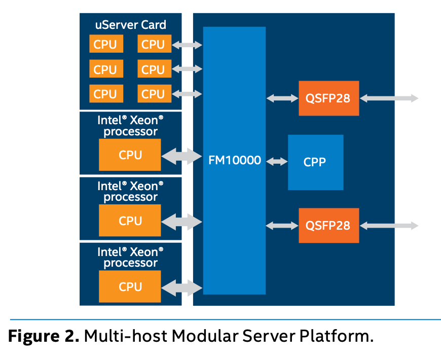
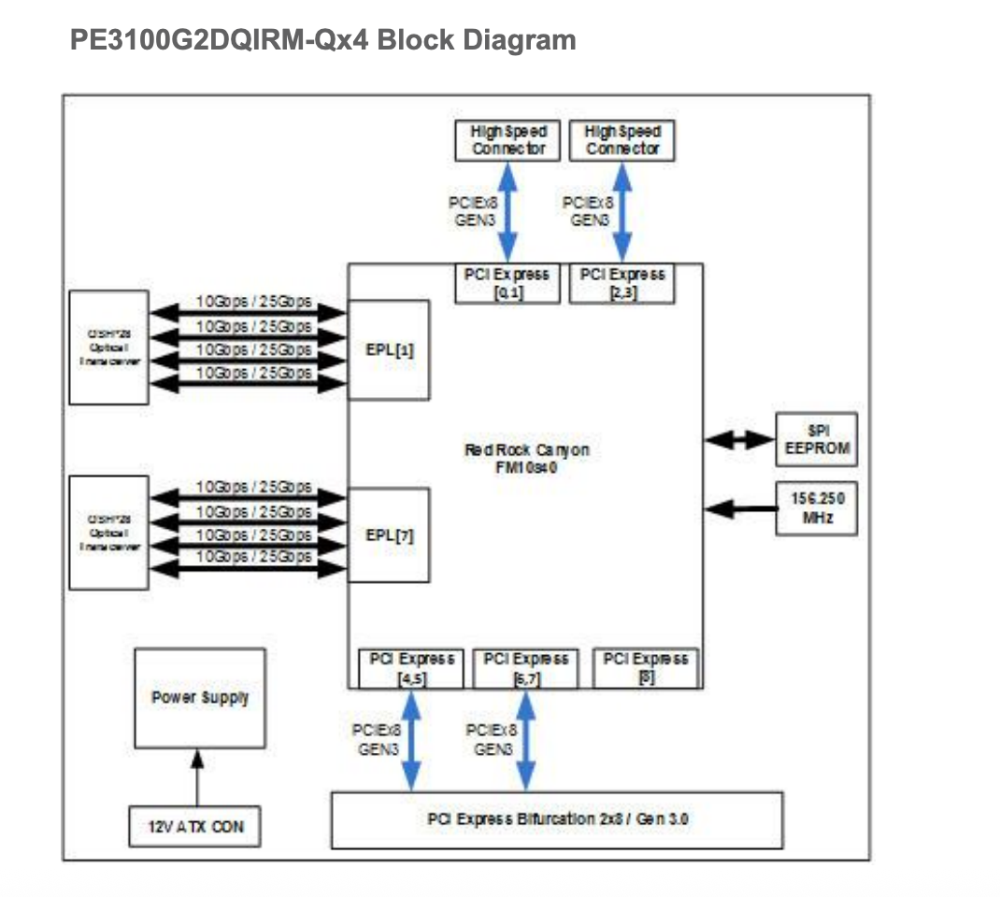
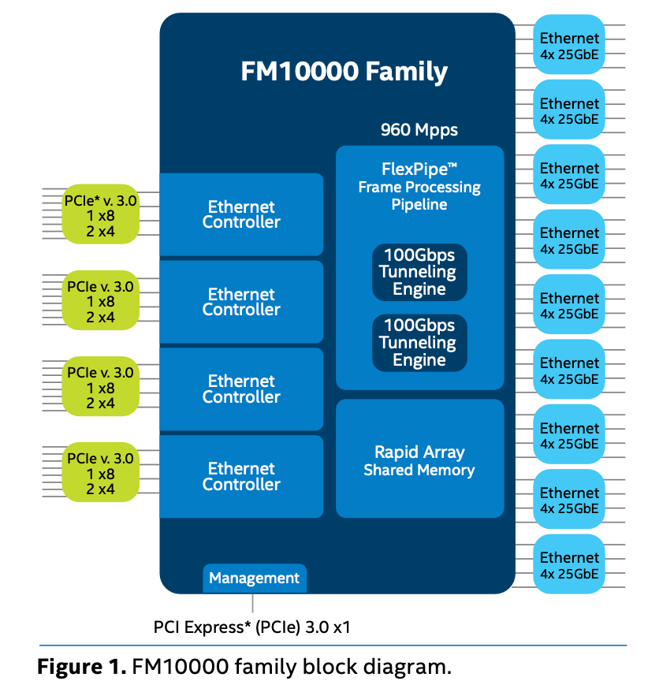

## 前言

如果说闲言少叙那我总想多说点什么，第一次遇到FM10K是在cyberbus上面。有人搞了一块Intel FM10840的网卡 **Silicom PE3100G2DQIRM**！



没错，看起来有点抽象。但这就是Intel的Multi-host Modular Server Platform

这个东西可以充当一个简易的交换机，一张网卡拆分多个端口可以被多台设备使用。



由于看着很神奇，所以手痒痒就想去折腾折腾看看这套神奇的东西。

只可惜FM10K已经是EOL的产品了，后续的软件折腾还是比较麻烦的事情。

# 网卡介绍

> 拿到这张卡实属捡漏，感谢商家

这次拿到的卡是Silicom的PE3100G2DQIR，基于Intel FM10420 芯片打造。由于没有这张卡的Block Diagram 所以只能用另一款来代替。



很简单的结构，两个QSFP28的口子，可以拆分成8个10/25G。或者是当两个40G（10G*4）来用 

但是这张卡让我没想到的是需要接一个12V的供电 这东西最大才30W那需要外接供电这种东西。


| 配置                    | 功耗 (W) | 电流 (A @ 12V) | 运行状态               | 类型     |
|-----------------------------|----------|----------------|------------------------|----------|
| 全端口装 100GBASE-SR4 模块  | 30.72    | 2.56           | 所有端口 100 Gb/s 运行 | Typical  |
| 全端口装 100GBASE-LR4 模块  | 29.40    | 2.45           | 所有端口 100 Gb/s 运行 | Typical  |
| 未安装 SFP+ 模块（No SFP+） | 26.88    | 2.24           | —                      | Typical  |


Intel对FM10K这个控制器的定义以太网与交换机的混合体。实际你完全可以把它看成是一个交换机的转发平面，把host当成一个控制平面。通过控制平面下发指令操作转发平面完成对数据的转发/丢弃/丢给host。



- 4 MB shared memory 
- L2/L3/L4/OpenFlow forwarding
- 32K 40-bit TCAM entries 
- 16K MAC and NextHop tables 
- NSH Service Function Classifier and Forwarder

这或许就是一个交换机芯片。有 16K的MAC表 32K的TCAM条目（感觉比某些螃蟹交换机配置都好）

## 食用指南

```shell
# lspci -s 05:00.0 -vv | egrep 'LnkCap|LnkSta'
		LnkCap:	Port #0, Speed 8GT/s, Width x8, ASPM L1, Exit Latency L0s <512ns, L1 <64us
		LnkSta:	Speed 8GT/s, Width x8, TrErr- Train- SlotClk- DLActive- BWMgmt- ABWMgmt-
		LnkSta2: Current De-emphasis Level: -6dB, EqualizationComplete+, EqualizationPhase1+
# lspci -s 06:00.0 -vv | egrep 'LnkCap|LnkSta'
		LnkCap:	Port #0, Speed 8GT/s, Width x8, ASPM L1, Exit Latency L0s <512ns, L1 <64us
		LnkSta:	Speed 8GT/s, Width x4, TrErr- Train- SlotClk- DLActive- BWMgmt- ABWMgmt-
		LnkSta2: Current De-emphasis Level: -6dB, EqualizationComplete+, EqualizationPhase1+
这张卡存在了一些小问题，两个PCIE拆分后似乎主办并不能很好的识别。第二个PCIE BUS 只有x4的速度 日志中同样有体现

[   18.467950] fm10k 0000:05:00.0: 63.008 Gb/s available PCIe bandwidth (8 GT/s x8 link)
[   18.483618] fm10k 0000:06:00.0: 31.504 Gb/s available PCIe bandwidth, limited by 8 GT/s x4 link at 0000:04:09.0 (capable of 63.008 Gb/s with 8 GT/s x8 link)

# ethtool -i enp5s0
driver: fm10k
version: 0.27.1-gs-patched     #这个驱动并非原版 原版无法满足UIO通讯
firmware-version: 
expansion-rom-version: 
bus-info: 0000:05:00.0
supports-statistics: yes
supports-test: yes
supports-eeprom-access: no
supports-register-dump: yes
supports-priv-flags: yes

```

由于使用的是 Silicom 的方案，可使用其 RDIF控制工具(Silicom Linux RDI Control Utility)。该工具实现了大部分管理功能，可作为后台常驻的 daemon 运行。它通过 CLI方式向管理平面暴露 API，对下通常通过内核驱动（UIO）与数据平面交互。

注：不开启Rdif时，网口无法正常的启用。

```shell

# rdif start

RDIF daemon version 6.0.10.7.30.1
Loading /etc/rdi/fm_platform_attributes.cfg
SILICOM bprd_ctl driver is not loaded
Connect to host driver using /dev/uio0
Found netdev ens9 (derived from uio device /dev/uio0)
Switch #0 inserted!

Port 0:2 module autodetected (XCVR_TYPE_100G_QSFP28_OPT)
          ethMode: 100GBASE_LR4
29.9.2025 12:19:54 port event: unit 0 port 4 is up
29.9.2025 12:19:54 port event: unit 0 port 3 is up
29.9.2025 12:19:54 port event: unit 0 port 3 is up
29.9.2025 12:19:54 port event: unit 0 port 4 is up
Switch is UP, all ports are now enabled
29.9.2025 12:19:56 lport event: unit 0 port 4101 pepId 0 pepLogicalPort 3 portCreated 1
29.9.2025 12:19:56 lport event: unit 0 port 4293 pepId 2 pepLogicalPort 4 portCreated 1
29.9.2025 12:19:56 lport event: unit 0 port 4101 pepId 0 pepLogicalPort 3 portCreated 0
29.9.2025 12:19:56 lport event: unit 0 port 4101 pepId 0 pepLogicalPort 3 portCreated 1
29.9.2025 12:19:56 lport event: unit 0 port 4293 pepId 2 pepLogicalPort 4 portCreated 0
29.9.2025 12:19:56 lport event: unit 0 port 4293 pepId 2 pepLogicalPort 4 portCreated 1
29.9.2025 12:19:58 port event: unit 0 port 2 is up
```

Port 3和Port 4分别是两条PCIE暴露给Host端的端口，而Port 1 和Port 2才是实际的物理端口。


