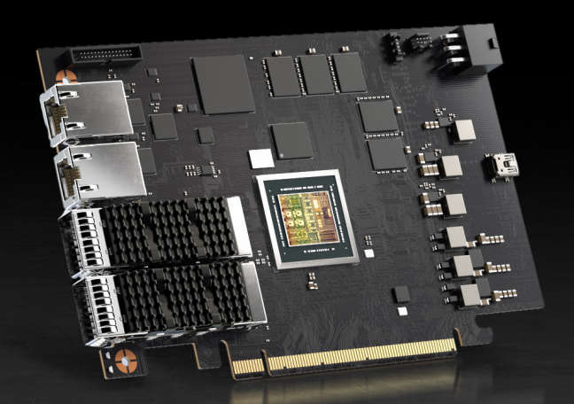
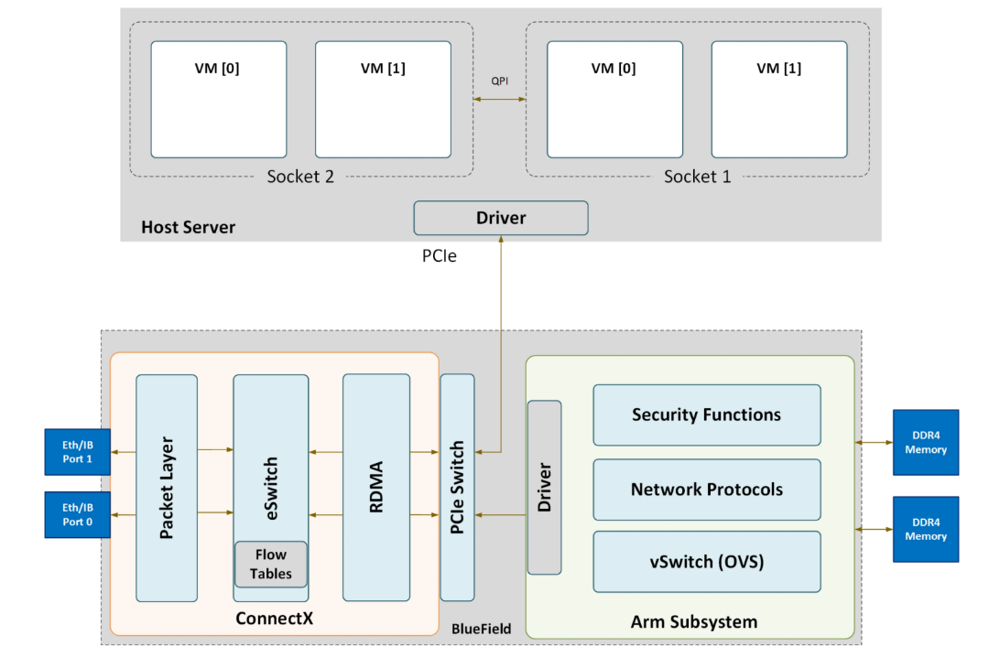

> 我好想买一个BF3啊啊啊啊啊啊啊
>
> 哎？你说我要不要放一个标题进去呢




## 先看看结构吧



跟BCM小太阳的PS225类似，这块BF2也是arm+自家的网卡芯片结构。bf2同时向host和arm暴露网口。

网卡分为了两种模式，DPU模式和NIC模式。

当服务器与 DPU 启动时，通往主机的网络连接将被阻断，直至 DPU 上的虚拟交换机完成加载。虚拟交换机加载完成后，默认允许主机通信流量通过。

```
                                    HOST AREA                    :             ARM AREA
                               +----------------------+          :    +-------------------------+
                               |        HOST          |          :    |           ARM           |
                               |                      |          :    |      +-----------+      |
                               |   (Offload)  (Slow)  |          :    |      |    OVS    |      |
                               |      |         \     |          :    |      +---^---|---+      |
                               +------+----------\----+          :    |          |   |          |
                                      |           \              :    |          |   |          |
                                     PF0          PF1            :          ECPF0|   |ECPF1     |
                                      |             \            :               |   |          |
                               =======|==============\===========:===============|===|===========
                                      |               \          :               |   |
                               +------v----------------\---------:---------------|---v--------+
                               |                        \        :      /--------/            |
                               |                         \_______:_____/                      |
                               |                             eSwitch                          |
                               +------|--------------------------:-------------------|--------+
                                      |                          :                   |
                                      v                          :                   v
```

向主机接口传递流量有两种方式：

- 通过 representor 代理将流量转发至主机（每份进出主机的数据包都会由 Arm 端嵌入式网络接口二次处理）；
- 向内嵌交换机推送流量卸载规则，直接放行该流量。


## 固件升级

抬手先检查一下固件，在线升级发现版本到24.43.1014。由于bf2新版本的固件已经转移到了BFB文件。所以要用另一种升级方法。

```shell
# mlxfwmanager --online -u
Querying Mellanox devices firmware ...

Device #1:
----------

  Device Type:      BlueField2
  Part Number:      MBF2H332A-AENO_Ax_Bx
  Description:      BlueField-2 P-Series DPU 25GbE Dual-Port SFP56; PCIe Gen4 x8; Crypto Disabled; 16GB on-board DDR; 1GbE OOB management; HHHL
  PSID:             MT_0000000539
  PCI Device Name:  /dev/mst/mt41686_pciconf0
  Base GUID:        *****************
  Base MAC:         **********
  Versions:         Current        Available     
     FW             24.42.1000     24.43.1014    
     PXE            3.7.0500       3.7.0500      
     UEFI           14.35.0015     14.36.0016    
     UEFI Virtio blk   22.4.0013      N/A           
     UEFI Virtio net   21.4.0013      N/A           

  Status:           Update required

```

先去下面网址下载最新版的固件bfb 

[NVIDIA DOCA 3.2.0 LTS Downloads](https://developer.nvidia.com/doca-downloads?deployment_platform=BlueField&deployment_package=BF-FW-Bundle&installer_type=BFB)

```shell
# bfb-install  --bfb bf-fwbundle-3.2.0-113_25.10-prod.bfb --rshim rshim0
Checking if local host has root access...
Checking if rshim driver is running locally...
Pushing bfb
 693MiB 0:01:52 [6.19MiB/s] [                                                                                <=>                                                                                               ]
Collecting BlueField booting status. Press Ctrl+C to stop…
 INFO[BL2]: start
 INFO[BL2]: boot mode (rshim)
 INFO[BL2]: DDR POST passed
 INFO[BL2]: UEFI loaded
 INFO[BL31]: start
 INFO[BL31]: lifecycle GA Non-Secured
 INFO[BL31]: runtime
 INFO[UEFI]: UPVS valid
 INFO[UEFI]: eMMC init
 INFO[UEFI]: eMMC probed
 INFO[UEFI]: PMI: updates started
 INFO[UEFI]: PMI: total updates: 1
 INFO[UEFI]: PMI: updates completed, status 0
 INFO[UEFI]: PCIe enum start
 INFO[UEFI]: PCIe enum end
 INFO[UEFI]: UEFI Secure Boot (disabled)
 INFO[UEFI]: Redfish enabled
 INFO[UEFI]: exit Boot Service
 INFO[MISC]: Updating NIC firmware...
 INFO[MISC]: NIC firmware update done: 24.47.1026
 INFO[MISC]: Installation finished
 
 
# mlxfwmanager --online -u
Querying Mellanox devices firmware ...

Device #1:
----------

  Device Type:      BlueField2
  Part Number:      MBF2H332A-AENO_Ax_Bx
  Description:      BlueField-2 P-Series DPU 25GbE Dual-Port SFP56; PCIe Gen4 x8; Crypto Disabled; 16GB on-board DDR; 1GbE OOB management; HHHL
  PSID:             MT_0000000539
  PCI Device Name:  /dev/mst/mt41686_pciconf0
  Base GUID:        *****************
  Base MAC:         **********
  Versions:         Current        Available     
     FW             24.47.1026     24.43.1014    
     FW (Running)   24.42.1000     N/A           
     PXE            3.7.0500       3.7.0500      
     UEFI           14.35.0015     14.36.0016    
     UEFI Virtio blk   22.4.0013      N/A           
     UEFI Virtio net   21.4.0013      N/A           

  Status:           Up to date
```

