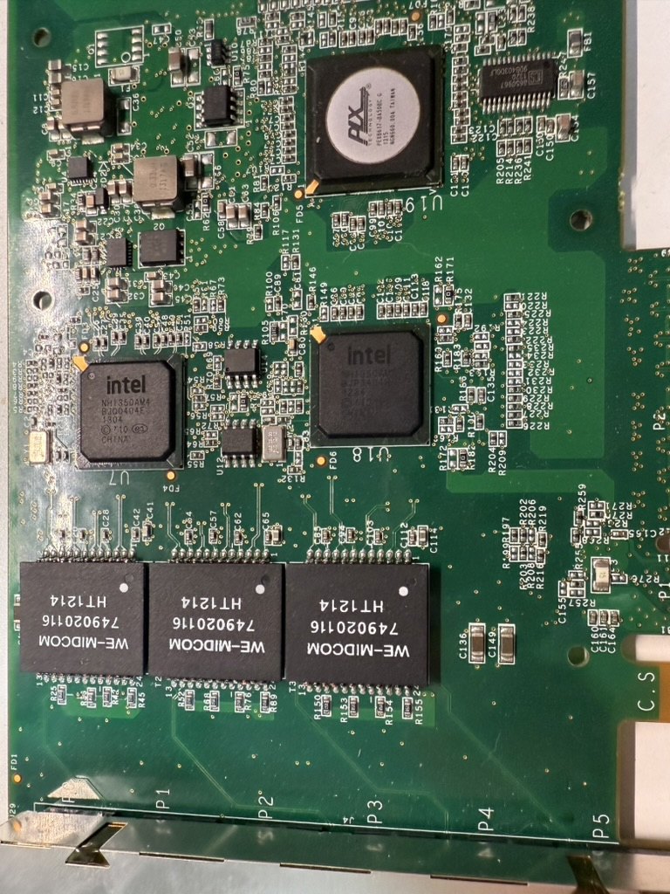

> 有请我们今天的重要嘉宾 Intel I350 Ethernet Controller 
>

最近在使用T-Rex进行打流测试，所以需要多口的网卡来实现。在网上搜索半天就发现了Intel I350-T6这个神奇的东西

但是intel只过I350-AM4与I350-AM2两款以太网控制器 分别对应是4端口与2端口。

拆开这张网卡的散热就可以发现其中的奥秘了

这张网卡由一个PLX 芯片 PEX8617 搭配两个Intel I350所构成。

就此这张网卡的大体结构已经搞清楚了（ 

在文章结尾还是祭奠一下intel吧，网卡产线已经被砍了。不知道下一个砍掉的会是谁。 
