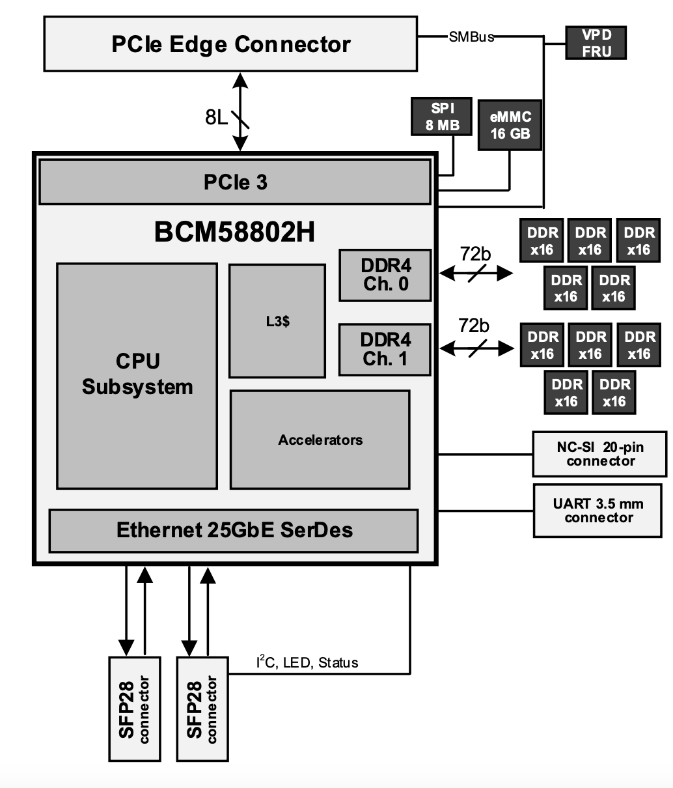
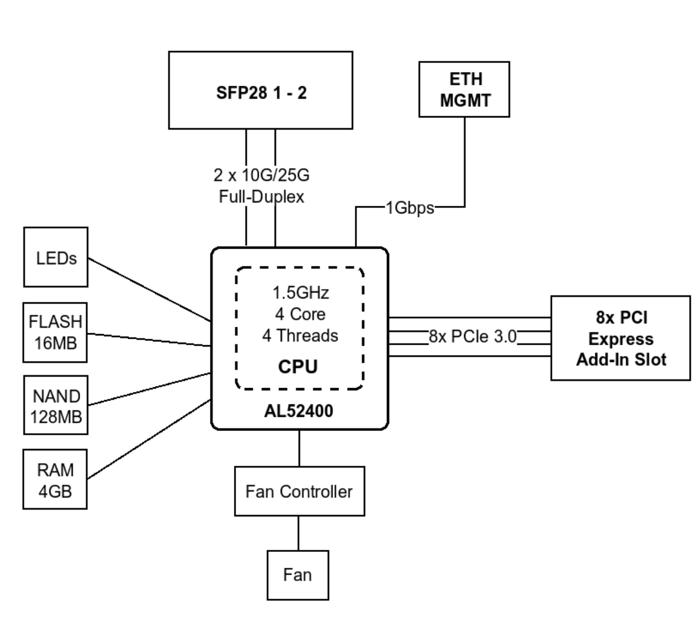
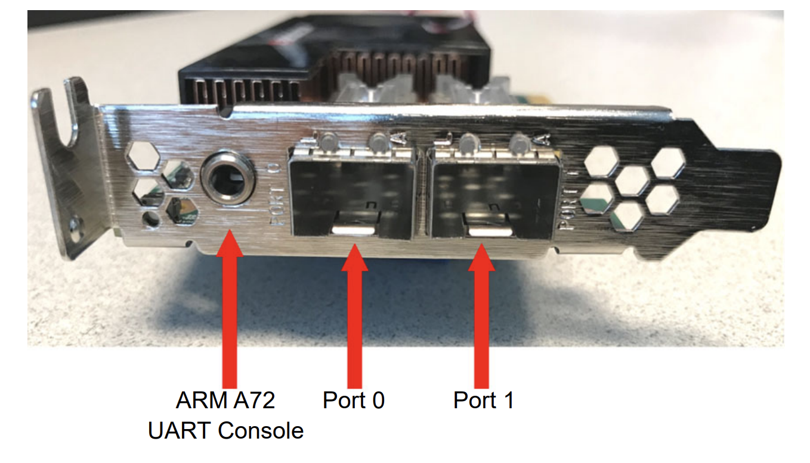
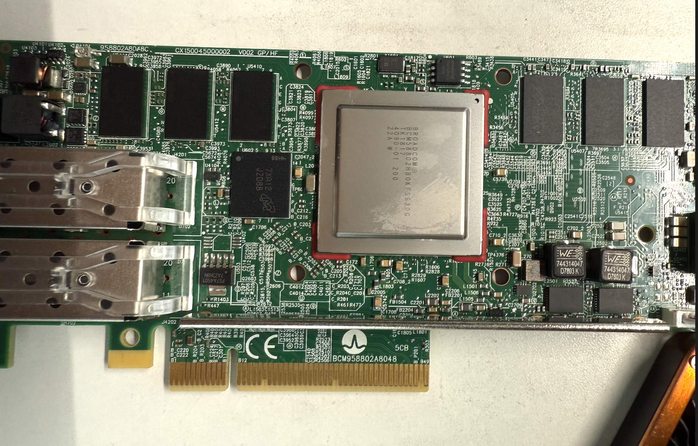
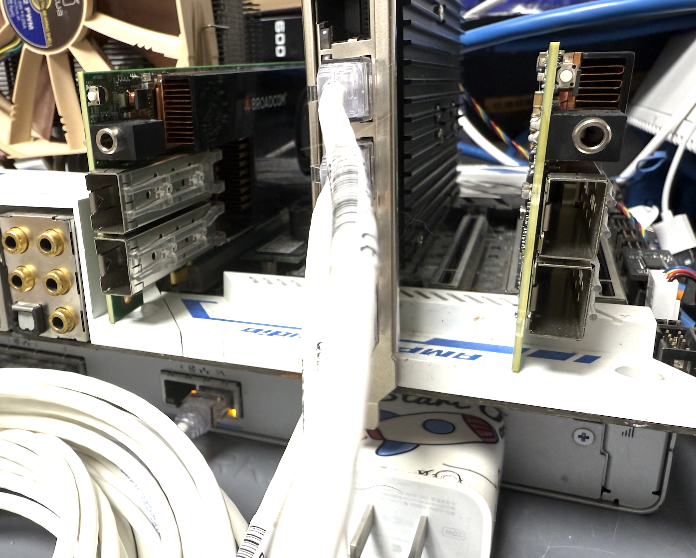
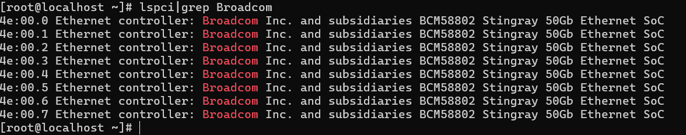
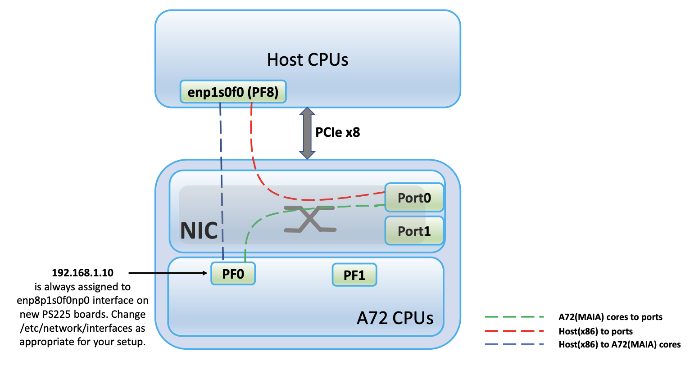

# PS225的踩坑日志

> 最近从群友白嫖到了两张ps225 索性有了本篇文章。

## PS225的架构

ps225是一个经典的dpu，8核心arm72搭配自家的以太网控制器Nitro组成

看到这张图的时候我在想，这个产品会与Mikrotik的CCR2004-1G-2XS-PCIe差距有多大。因为Mikrotik的结构与其类似，都是SOC连接网口。以至于我一直怀疑这个产品的性能到底会怎么样。

CCR2004由于其4核心的处理器与1.5G的主频，使得即使是直通模式也无法跑满50G。如果转为使用桥接模式则性能会有更加严重的衰减。

## 硬件部分

硬件部分也是我最想吐槽的东西了，PS225的console口是3.5mm的耳机接口

他们提供了建议配件 FTDI的3.3v TTL 转接线，但是由于手里暂时没有所以只能放弃连接了。（日后填坑吧）

卡片整体外观如下，中间那颗大大的就是BCM58802H。其散热器的硅脂上疑似有一层金属膜（不知道是出场忘记撕了还是导热用的。风扇插上去十分的吵，建议自行更换。

## 上机测试

由于用惯了epyc，导致我忘记x99平台的pcie通道是残缺的。所以就有了这样子的地狱构图。

在lspci中可以看到Broadcom小太阳已经成功的识别到了，并且是50G的Ethernet Soc。

但是在这里有一点是让我存疑的。如下图所示主机侧的PF8与PF0通过NIC相连且与PF0与PF8均与Port0相连。这样子是不是可以将NIC理解为一个类似Nvidia里面bf2的eswitch？

其命名规则倒是简单的，x86 主机上所有偶数编号的接口（例如 enp1s0f0、enp1s0f2、enp1s0f4 和 enp1s0f6）都会连接到Port 0。同样，ARM 设备上偶数编号的接口（如 enP8p1s0f0np0、enP8p1s0f2np0、enP8p1s0f4np0 和 enP8p1s0f6np0）也连接到Port 0。而 x86 主机和 ARM 设备上所有奇数编号的接口则被连接到Port 1。
