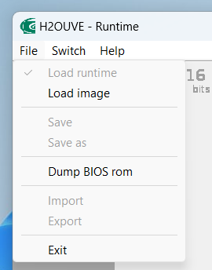
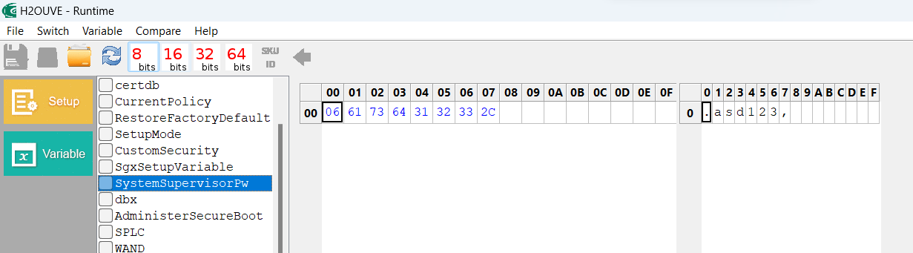

# 红米Redmibook 16 Bios密码找回

只能说这是一个困扰了我很久的问题，之前给bios随手设置了一个密码但是想不起来密码是什么了。所以才有了这篇踩坑日志。

[H2O工具包下载](https://cloud.lenxy.net/s/jRfM)

## 提取BIOS

> :exclamation: 注: 使用前请执行WDFInst.exe 来初始化 

使用H2OUVE对当前运行的bios进行提取

## 查找密码

点击Variable 找到SystemSupervisorPW 查看明文密码（对 bios里保存的是明文密码

