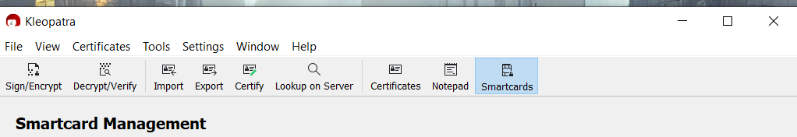
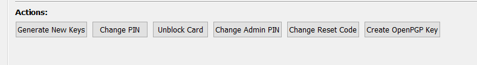
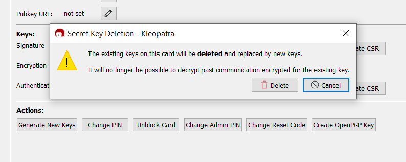
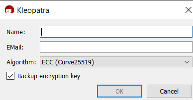
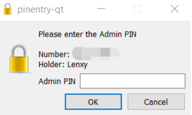
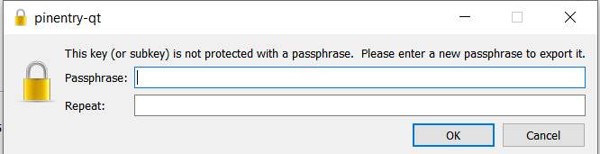
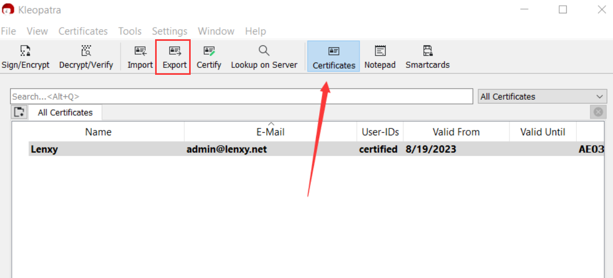
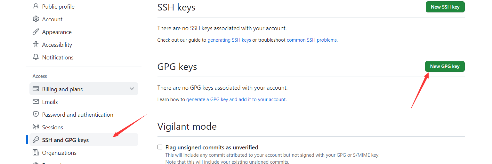
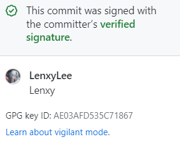

# 使用Yubikey来签署Git Commits

既然准备就绪 那我们就开始吧。一共有两种方法去生成GPG Key。 其一本机生成 GPG KEY，然后将数据导入到 YubiKey。其二直接在 YubiKey 上生成密钥。我将介绍后者的步骤。

需要的工具：[gpg4win](https://www.gpg4win.org/)

安装完毕gpg4win后打开Kleopatra


## 修改Yubikey的Admin PIN与PIN

> Yubikey中pin的默认密码为123456 Admin Pin为12345678 
>
> :exclamation:多次密码错误会导致锁定

插入Yubikey随后选择`SmartCards`



选择下方的`Change PIN`与`Change Admin PIN`进行PIN修改



## 生成gpg密钥并导入到Yubikey


选择选项`Generate New Keys`（如果原yubikey中有数据，将会清空原有内容并替换为新的密钥



填入签发人与邮箱



需要多次输入Admin PIN与PIN 注意观察 别输错了



最后一步，输入Key的密码短语



生成完毕可以在`Certificates`处看到我们的证书，点击`Export`对公钥进行导出



将密钥使用记事本打开，并放入Github中的`GPG Keys`中



## Git的配置

如果您之前已将 Git 配置为在使用 `--gpg-sign` 进行签名时使用不同的密钥格式，请取消设置此配置，以便使用 `openpgp` 的默认格式。

```shell
git config --global --unset gpg.format
```

使用 `gpg --list-secret-keys --keyid-format=long` 命令列出您拥有公钥和私钥的 GPG 密钥的长格式。

```shell
gpg --list-secret-keys --keyid-format=long
```

从 GPG 密钥列表中，复制您要使用的 GPG 密钥 ID 的完整形式。在此示例中，GPG 密钥 ID 为 `3AA5C34371567BD2` 

```
gpg --list-secret-keys --keyid-format=long
/Users/hubot/.gnupg/secring.gpg
------------------------------------
sec   4096R/3AA5C34371567BD2 2016-03-10 [expires: 2017-03-10]
uid                          Hubot <hubot@example.com>
ssb   4096R/4BB6D45482678BE3 2016-03-10
```

要在 Git 中设置主 GPG 签名密钥，请粘贴下面的文本，并替换为您要使用的 GPG 主密钥 ID。在此示例中，GPG 密钥 ID 为 `3AA5C34371567BD2`

```Shell
git config --global user.signingkey <你的主密钥ID>
#Example:
git config --global user.signingkey 3AA5C34371567BD2
#以下命令对所有 Git 提交进行签名
git config --global commit.gpgsign true
```

## 大功告成

后续就是上传去github看看是否成功


